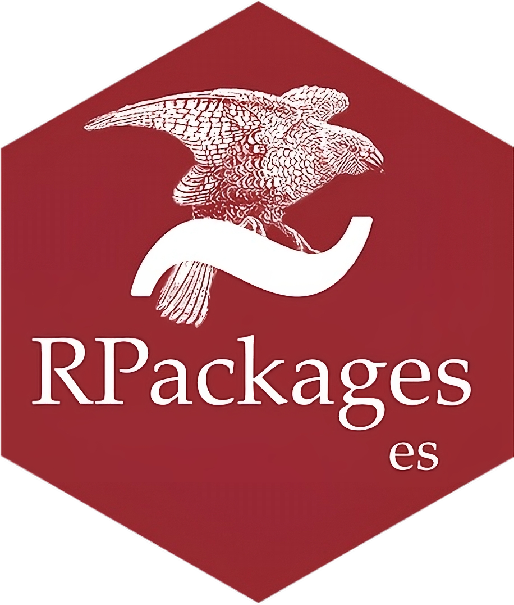

# Spanish

## Paquetes de R

<a href="https://a.co/d/0kQeXbl"></a> Este repositorio contiene el código fuente del libro **"Paquetes de R"** de Hadley Wickham & Jenny Bryan.
El libro está construido usando [Quarto](https://quarto.org/).
En este libro aprenderá cómo convertir su código en paquetes que otros puedan descargar y usar fácilmente.
Los paquetes son las unidades fundamentales del código R reproducible.
Incluyen funciones R reutilizables, la documentación que describe cómo usarlas y datos de muestra.
Escribir un paquete puede parecer abrumador al principio.
Así que comience con lo básico y mejórelo con el tiempo.
No importa si tu primera versión no es perfecta siempre y cuando la próxima versión sea mejor.

-   La primera edición ya no está disponible online.
-   Se está desarrollando una segunda edición y está disponible en <https://r-pkgs.org>.

## Sobre la traducción

Esta traducción de "Paquetes de R" es un proyecto personal de [David Díaz Rodríguez](https://github.com/davidrsch) con el objetivo de facilitar el estudio de construcción de paquetes de R, tanto al propio traductor como a todas aquellas personas de habla hispana que deseen aprender sobre este tema.

Señalar que esta es una traducción textual del libro por lo que cuando los autores se refieren así mismo en primera persona, serán Hadley Wickham & Jenny Bryan no el traductor.

La traducción fue realizada usando Google Translate y fueron corregidos algunos errores gramaticales y de coherencia.
Si detecta algún error relacionado con el contenido de la traducción, siéntase libre de abrir un issue o un pull request en este [repositorio](https://github.com/davidrsch/r-pkgses).

## Más información acerca del repositorio

### Notas sobre mecanica

[Las notas en Quarto](https://quarto.org/docs/authoring/callouts.html) tienen este aspecto:

```         
::: callout-tip
¡Aquí tienes algo ingenioso y muy útil!
:::
```

En el momento de escritura (31 de agosto de 2022), utilizamos `callout-tip`, `callout-warning`, `callout-note` y `callout-important`.
El `XXX` de `callout-XXX` es su tipo y controla el ícono y el color:

-   `-tip` verde
-   `-warning` naranja
-   `-note` azul
-   `-important` rojo

Utilice un encabezado de nivel `##` para subtitular la leyenda.

Haga esto para consejos específicos de RStudio:

```         
::: callout-tip
## RStudio
Aquí hay algo muy útil e ingenioso sobre RStudio específicamente.
:::
```

La otra leyenda que aparece varias veces es:

```         
::: callout-warning
## Envío a CRAN
Aquí hay algo con lo que hay que tener mucho cuidado.
:::
```

# English

## R Packages

<a href="https://amzn.to/35Hn96s"></a> This repository contains the source for [*R Packages*](https://tmwr.org) by Hadley Wickham & Jenny Bryan.
The book is built using [Quarto](https://quarto.org/).
In this book you'll learn how to turn your code into packages that others can easily download and use.
Packages are the fundamental units of reproducible R code.
They include reusable R functions, the documentation that describes how to use them, and sample data.
Writing a package can seem overwhelming at first.
So start with the basics and improve it over time.
It doesn't matter if your first version isn't perfect as long as the next version is better.

-   The first edition is no longer available online.
-   A second edition is under development and available at <https://r-pkgs.org>.

## About the translation

This translation of "R Packages" is a personal project by [David Díaz Rodríguez](https://github.com/davidrsch) with the aim of daciltating the process of building R Packages, both for the translator himself and for all those Spanish-speaking people who wish to learn about this topic.

Note that this is a verbatim translation of the book so when the authors refer to themselves in the first person, it will be Hadley Wickham & Jenny Bryan not the translator.

The translation was done using Google Translate and some grammar and coherence errors were corrected.
If you spot any issue related to the translation content, feel free to open an issue or pull request on this [repository](https://github.com/davidrsch/r-pkgses).

## More info about the repository

### Notes on mechanics

[Quarto callouts](https://quarto.org/docs/authoring/callouts.html) look like this:

```         
::: callout-tip
Here's a super handy nifty thing!
:::
```

At the time of writing (2022-08-31), we use `callout-tip`, `callout-warning`, `callout-note`, and `callout-important`.
The `XXX` of `callout-XXX` is its type and controls the icon and color:

-   `-tip` green
-   `-warning` orange
-   `-note` blue
-   `-important` red

Use a `##`-level header to caption the callout.

Do this for tips specific to RStudio:

```         
::: callout-tip
## RStudio
Here's a super handy nifty thing about RStudio specifically.
:::
```

The other callout that appears multiple times is:

```         
::: callout-warning
## Submitting to CRAN
Here's something to super careful about.
:::
```
