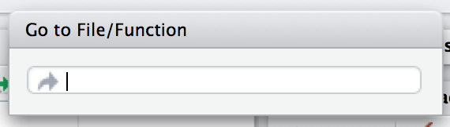

[[sec-r]]
= Código R
:description: Aprenda a crear un paquete, la unidad fundamental de contenido compartible, reutilizable, y código R reproducible.
:lang: es

El primer principio al crear un paquete es que todo el código R va al directorio `R/`. En este capítulo, aprenderá a organizar sus funciones en archivos, mantener un estilo consistente y reconocer los requisitos más estrictos para las funciones en un paquete (en comparación con un script). También le recordaremos los flujos de trabajo fundamentales para realizar pruebas de manejo y verificar formalmente un paquete en desarrollo: `load++_++all()`, `test()`, y `check()`.

[[sec-code-organising]]
== Organizar funciones en archivos

La única regla estricta es que su paquete debe almacenar sus definiciones de funciones en scripts R, es decir, archivos con extensión `.R`, que se encuentran en el directorio `R/`{empty}footnote:[Desafortunadamente no puedes usar subdirectorios dentro de `R/`. La mejor opción es utilizar un prefijo común, por ejemplo, `abc-++*++.R`, para indicar que un grupo de archivos está relacionado.]. Sin embargo, algunas convenciones más pueden hacer que el código fuente de su paquete sea más fácil de navegar y evitarle tener que volver a responder "`¿Cómo debería nombrar esto?`" cada vez que crea un nuevo archivo. La Guía de estilo de Tidyverse ofrece algunos https://style.tidyverse.org/files.html[consejos generales sobre nombres de archivos] y también https://style.tidyverse.org/package-files.html[consejos que se aplican específicamente a archivos en un paquete]. Nosotros ampliamos esto aquí.

El nombre del archivo debe ser significativo y transmitir qué funciones están definidas en él. Si bien eres libre de organizar funciones en archivos como desees, los dos extremos son malos: no coloques todas las funciones en un archivo y no coloques cada función en su propio archivo separado. Este consejo debe informar su política general, pero hay excepciones a cada regla. Si una función específica es muy grande o tiene mucha documentación, puede tener sentido darle su propio archivo, con el nombre de la función. Más a menudo, un único archivo `.R` contendrá múltiples definiciones de funciones: como una función principal y sus ayudas de apoyo, una familia de funciones relacionadas o alguna combinación de las dos.

<<tbl-putting-functions-in-files>> presenta algunos ejemplos de la fuente real del paquete http://tidyr.tidyverse.org/[tidyr] en la versión 1.1.2. Hay algunas desviaciones de las reglas estrictas dadas anteriormente, lo que ilustra que hay mucho margen para juzgar aquí.

.Different ways to organize functions in files.
[[tbl-putting-functions-in-files]]
====

[width="100%",cols="<15%,<8%,<77%",options="header",]
|===
|Organising principle |Source file |Comments
|Una función |https://github.com/tidyverse/tidyr/blob/v1.1.2/R/uncount.R[tidyr/R/uncount.R] |Define exactamente una función, `uncount()`, que no es particularmente grande, pero no encaja naturalmente en ningún otro archivo `.R`
|Función principal más ayudantes |https://github.com/tidyverse/tidyr/blob/v1.1.2/R/separate.R[tidyr/R/separate.R] |Define el `separate()` orientado al usuario (un genérico de S3), un método `data.frame` y ayudantes privados
|Familia de funciones |https://github.com/tidyverse/tidyr/blob/v1.1.2/R/rectangle.R[tidyr/R/rectangle.R] |Define una familia de funciones para "`rectangular`" listas anidadas (funciones `hoist()` y `unnest()`), todas documentadas juntas en un gran tema de ayuda, además de ayudas privadas.
|===

====

[TIP]
====
Otro archivo que ve a menudo en estado salvaje es `R/utils.R`. Este es un lugar común para definir pequeñas utilidades que se utilizan dentro de múltiples funciones de paquetes. Dado que sirven como ayuda para múltiples funciones, colocarlos en `R/utils.R` hace que sea más fácil redescubrirlos cuando regrese a su paquete después de un largo descanso.

Bob Rudis reunió una colección de dichos archivos e hizo algunos análisis en la publicación https://rud.is/b/2018/04/08/dissecting-r-package-utility-belts/[Dissecting R Package "`Utility Belts`"].

====

Si es muy difícil predecir en qué archivo se encuentra una función, eso sugiere que es hora de separar sus funciones en más archivos o reconsiderar cómo nombra sus funciones y/o archivos.

[TIP]
.RStudio
====
La organización de funciones dentro de archivos es menos importante en RStudio, que ofrece dos formas de saltar a la definición de una función:

* Presione Ctrl {plus} `.` (el punto) para abrir la herramienta _Ir a archivo/función_, como se muestra en <<fig-go-to-file-function>>, luego comience a escribir el nombre. Siga escribiendo para limitar la lista y, finalmente, elija una función (o archivo) para visitar. Esto funciona tanto para funciones como para archivos de su proyecto.
+
.Vaya a Archivo/Función en RStudio.
[#fig-go-to-file-function]

* Con el cursor en el nombre de una función o con un nombre de función seleccionado, presione F2. Esto funciona para funciones definidas en su paquete o en otro paquete.

Después de navegar a una función con uno de estos métodos, regrese al punto de partida haciendo clic en la flecha hacia atrás en la parte superior izquierda del editor. (image:images/arrows.png[images/arrows,width=33,height=16]) o presionando Ctrl {plus} F9 (Windows & Linux) o Cmd {plus} F9 (macOS).

====

[[sec-code-load-all]]
== Comentarios rápidos a través de `load++_++all()`

A medida que agrega o modifica funciones definidas en archivos debajo de `R/`, naturalmente querrá probarlas. Queremos reiterar nuestra firme recomendación de utilizar `devtools::load++_++all()` para que estén disponibles para la exploración interactiva en lugar de, por ejemplo, archivos `source()` a continuación `R/`. La cobertura principal de `load++_++all()` está en <<sec-workflow101-load-all>> y `load++_++all()` también aparece como una de las tareas de desarrollo naturales en <<sec-whole-game-load-all>>. La importancia de `load++_++all()` en el flujo de trabajo de prueba se explica en <<sec-testing-design-tension>>. En comparación con las alternativas, `load++_++all()` le ayuda a iterar más rápidamente y proporciona una excelente aproximación al régimen de espacio de nombres de un paquete instalado.

== Code style

Recomendamos seguir la guía de estilo de tidyverse (https://style.tidyverse.org), que detalla muchos más detalles que los que podemos encontrar aquí. Su formato también le permite ser un documento más dinámico que este libro.

Aunque la guía de estilo explica el "`qué`" y el "`por qué`", otra decisión importante es _cómo_ imponer un estilo de código específico. Para ello recomendamos el paquete styler (https://styler.r-lib.org); su comportamiento predeterminado aplica la guía de estilo tidyverse. Hay muchas formas de aplicar Styler a su código, según el contexto:

* `styler::style++_++pkg()` rediseña un paquete R completo.
* `styler::style++_++dir()` Cambia el estilo de todos los archivos en un directorio.
* `usethis::use++_++tidy++_++style()` es un contenedor que aplica una de las funciones anteriores dependiendo de si el proyecto actual es un paquete R o no.
* `styler::style++_++file()` Cambia el estilo de un solo archivo.
* `styler::style++_++text()` Cambia el estilo de un vector de caracteres.

[TIP]
.RStudio
====
Cuando se instala styler, el menú de complementos de RStudio ofrecerá varias formas adicionales de aplicar estilo al código:

* la selección activa
* el archivo activo
* el paquete activo

====

[WARNING]
====
Si no usas Git u otro sistema de control de versiones, aplicar una función como `styler::style++_++pkg()` es estresante y algo peligroso, porque no tienes una forma de ver exactamente qué cambió y aceptar/rechazar dichos cambios. de forma granular.
====

El paquete styler también se puede integrar con varias plataformas para alojar el código fuente y realizar una integración continua. Por ejemplo, los paquetes tidyverse usan una acción de GitHub que cambia el estilo de un paquete cuando se activa mediante un comentario especial (`/style`) en una solicitud de extracción. Esto permite a los mantenedores concentrarse en revisar el contenido de la solicitud de extracción, sin tener que preocuparse por pequeños problemas de espacios en blanco o sangrías.footnote:[Consulte el https://github.com/r-lib/actions/tree/master/examples#commands-workflow[Flujo de trabajo de comandos] en https://github.com/%20r-lib/acciones[Acciones de GitHub para el lenguaje R] repositorio.] footnote:[La publicación del blog https://mikemcquaid.com/2018/06/05/robot-pedantry-human-empathy/[Robot Pedantry&#44; Human Empathy] de Mike McQuaid hace un excelente trabajo al resumir los beneficios de automatizar tareas como la recodificación de código. -peinado.] .

[[sec-code-when-executed]]
== Comprender cuándo se ejecuta el código

Hasta ahora, probablemente hayas estado escribiendo *scripts*, código R guardado en un archivo que ejecutas interactivamente, tal vez usando un IDE y/o `source()`, o de forma no interactiva a través de `Rscript`. Hay dos diferencias principales entre el código en scripts y paquetes:

* En un script, el código se ejecuta… ¡cuando lo ejecutas! La incomodidad de esta afirmación refleja que es difícil siquiera pensar en este tema con un guión. Sin embargo, debemos hacerlo para poder apreciar que el código de un paquete se ejecuta *cuando se compila el paquete*. Esto tiene grandes implicaciones sobre cómo escribe el código debajo de `R/`: el código del paquete solo debe crear objetos, la gran mayoría de los cuales serán funciones.
* Las funciones de tu paquete se utilizarán en situaciones que no imaginabas. Esto significa que sus funciones deben ser cuidadosas en la forma en que interactúan con el mundo exterior.

Ampliamos el primer punto aquí y el segundo en la siguiente sección. Estos temas también se ilustran concretamente en <<sec-package-within-build-time-run-time>>.

Cuando llamas `source()` a un script, cada línea de código se ejecuta y los resultados están disponibles inmediatamente. Las cosas son diferentes con el código del paquete, porque se carga en dos pasos. Cuando se compila el paquete binario (a menudo, mediante CRAN), se ejecuta todo el código en `R/` y se guardan los resultados. Cuando adjunta un paquete con `library()`, estos resultados almacenados en caché se recargan y ciertos objetos (principalmente funciones) quedan disponibles para su uso. Los detalles completos sobre lo que significa que un paquete esté en formato binario se proporcionan en <<sec-structure-binary>>. Nos referimos a la creación del paquete binario como "`tiempo de compilación`" (binario) y, específicamente, nos referimos a cuando se ejecuta `R CMD INSTALL --build`. (Se podría pensar que esto es lo que hace `R CMD build`, pero eso en realidad crea un paquete empaquetado, también conocido como un "`tarball fuente`".) Para los usuarios de paquetes CRAN de macOS y Windows, el tiempo de compilación es cuando CRAN creó el paquete binario para su sistema operativo. Para aquellos que instalan paquetes desde el código fuente, el tiempo de compilación es esencialmente cuando (construyeron e) instalaron el paquete.

Considere la asignación `x ++<++- Sys.time()`. Si pones esto en un script, `x` te dice cuándo el script fue `source()`d. Pero si coloca ese mismo código en el nivel superior de un paquete, `x` le indica cuándo se _construyó_ el binario del paquete. En <<sec-package-within-build-time-run-time>>, mostramos un ejemplo completo de esto en el contexto de la formación de marcas de tiempo dentro de un paquete.

La conclusión principal es esta:

____
Cualquier código R fuera de una función es sospechoso y debe revisarse cuidadosamente.
____

A continuación, exploramos algunos ejemplos del mundo real que muestran lo fácil que es quedar quemado por este problema de "`tiempo de construcción versus tiempo de carga`". Afortunadamente, una vez que se diagnostica este problema, generalmente no es difícil solucionarlo.

=== Ejemplo: Un camino devuelto por `system.file()`

El paquete shinybootstrap2 alguna vez tuvo este código a continuación `R/`:

[source,r,cell-code]
----
dataTableDependency <- list(
  htmlDependency(
    "datatables", "1.10.2",
    c(file = system.file("www/datatables", package = "shinybootstrap2")),
    script = "js/jquery.dataTables.min.js"
  ),
  htmlDependency(
    "datatables-bootstrap", "1.10.2",
    c(file = system.file("www/datatables", package = "shinybootstrap2")),
    stylesheet = c("css/dataTables.bootstrap.css", "css/dataTables.extra.css"),
    script = "js/dataTables.bootstrap.js"
  )
)
----

Entonces, `dataTableDependency` era un objeto de lista definido en el código del paquete de nivel superior y su valor se construyó a partir de rutas obtenidas a través de `system.file()`. Como se describe en https://github.com/rstudio/htmltools/issues/22[un problema de GitHub],

____
Esto funciona bien cuando el paquete se crea y se prueba en la misma máquina. Sin embargo, si el paquete se construye en una máquina y luego se usa en otra (como es el caso con los paquetes binarios CRAN), esto fallará: la dependencia apuntará al directorio incorrecto en el host.
____

El corazón de la solución es asegurarse de que `system.file()` se llame desde una función, en tiempo de ejecución. De hecho, esta solución se realizó aquí (en commit https://github.com/rstudio/shinybootstrap2/commit/138db47e6bef195f14f6a14f4289ca445e9b2efa#diff-fedcc5cc99f3d44a4caf06f8e6e0ae08[138db47]) y en algunos otros paquetes que tenían código similar y se agregó una verificación relacionada en el propio `htmlDependency()`. Este problema en particular ahora sería detectado por "`R CMD check`", debido a los cambios que vinieron con https://developer.r-project.org/Blog/public/2019/02/14/staged-install/index.html[instalación por etapas] a partir de R 3.6.0.

=== Ejemplo: Colores disponibles

El paquete crayon tiene una función, `crayon::show++_++ansi++_++colors()`, que muestra una tabla de colores ANSI en la pantalla, básicamente para mostrar qué tipo de estilo es posible. En una versión anterior, la función se parecía a esta:

[source,r,cell-code]
----
show_ansi_colors <- function(colors = num_colors()) {
  if (colors < 8) {
    cat("Los colores no son compatibles")
  } else if (colors < 256) {
    cat(ansi_colors_8, sep = "")
    invisible(ansi_colors_8)
  } else {
    cat(ansi_colors_256, sep = "")
    invisible(ansi_colors_256)
  }
}

ansi_colors_8 <- # código para generar un vector que cubre los colores básicos del terminal
  
ansi_colors_256 <- # código para generar un vector que cubre 256 colores
----

donde `ansi++_++colors++_++8` y `ansi++_++colors++_++256` eran vectores de caracteres que exploraban un determinado conjunto de colores, presumiblemente diseñados mediante escapes ANSI.

El problema era que esos objetos se formaban y almacenaban en caché cuando se compilaba el paquete binario. Dado que esto sucede a menudo en un servidor sin cabeza, es probable que esto suceda en condiciones en las que los colores del terminal podrían no estar habilitados o incluso disponibles. Los usuarios del paquete instalado aún podrían llamar a `show++_++ansi++_++colors()` y `num++_++colors()` detectaría la cantidad de colores admitidos por su sistema (256 en la mayoría de las computadoras modernas). Pero entonces un objeto sin color se imprimiría en la pantalla (el problema original de GitHub es https://github.com/r-lib/crayon/issues/37[r-lib/crayon#37]).

La solución fue calcular los objetos de visualización con una función en tiempo de ejecución (en confirmación https://github.com/r-lib/crayon/commit/e2b368ac27331d82154f85299f18efbc36227caa[e2b368a]:

[source,r,cell-code]
----
show_ansi_colors <- function(colors = num_colors()) {
  if (colors < 8) {
    cat("Colors are not supported")
  } else if (colors < 256) {
    cat(ansi_colors_8(), sep = "")
    invisible(ansi_colors_8())
  } else {
    cat(ansi_colors_256(), sep = "")
    invisible(ansi_colors_256())
  }
}

ansi_colors_8 <- function() {
  # código para generar un vector que cubre los colores básicos del terminal
}
  
ansi_colors_256 <- function() {
  # código para generar un vector que cubre 256 colores
}
----

Literalmente, se usa el mismo código, simplemente se inserta en el cuerpo de una función sin argumentos (similar al ejemplo de shinybootstrap2). Cada referencia a, por ejemplo, el objeto `ansi++_++colors++_++8` se reemplaza por una llamada a la función `ansi++_++colors++_++8()`.

La conclusión principal es que las funciones que evalúan o exponen las capacidades de su paquete en el sistema de un usuario deben ejecutarse completamente en el sistema de su usuario. Es bastante fácil confiar accidentalmente en resultados que se almacenaron en caché en el momento de la compilación, muy posiblemente en una máquina diferente.

=== Ejemplo: asignar un alias a una función

Un último ejemplo muestra que, incluso si tiene cuidado de definir solo funciones debajo de `R/`, todavía hay algunas sutilezas a considerar. Imagine que desea que la función `foo()` en su paquete sea básicamente un alias para la función `blah()` de algún otro paquete, p.e. paqueteB. Quizás tengas la tentación de hacer esto:

[source,r,cell-code]
----
foo <- pkgB::blah
----

Sin embargo, esto hará que `foo()` en su paquete refleje la definición de `pkgB::blah()` en la versión presente en la máquina donde se compila el paquete binario (a menudo CRAN), en ese momento. Si se descubre un error en `pkgB::blah()` y posteriormente se corrige, su paquete seguirá usando la versión anterior con errores, hasta que su paquete sea reconstruido (a menudo mediante CRAN) y sus usuarios actualicen, lo cual está completamente fuera de su alcance. Este enfoque alternativo lo protege de esto:

[source,r,cell-code]
----
foo <- function(...) pkgB::blah(...)
----

Ahora, cuando su usuario llama a `foo()`, efectivamente está llamando a `pkgB::blah()`, en la versión instalada en _su_ máquina en ese mismo momento.

Un ejemplo real de esto afectó a una versión anterior de knitr, relacionado con cómo el gancho "`evaluar`" predeterminado se estaba configurando en `evaluate::evaluate()` (el problema original es https://github%20.com/yihui/knitr/issues/1441[yihui/knitr#1441], resuelto en commit https://github.com/yihui/knitr/commit/d6b53e0f15a8afd1de4987a86931ba54f886278d[d6b53e0]).

[[sec-code-r-landscape]]
== Respeta el paisaje de R

Otra gran diferencia entre un script y un paquete es que otras personas usarán tu paquete y lo usarán en situaciones que nunca imaginaste. Esto significa que debe prestar atención al panorama de R, que incluye no sólo las funciones y objetos disponibles, sino también todas las configuraciones globales.

Ha cambiado el panorama de R si ha cargado un paquete con `library()`, o ha cambiado una opción global con `options()`, o ha modificado el directorio de trabajo con `setwd()`. Si el comportamiento de _otras_ funciones difiere antes y después de ejecutar su función, ha modificado el panorama. <<sec-package-within-side-effects>> tiene un ejemplo concreto de esto que involucra zonas horarias y la impresión de fechas y horas específicas de la localidad. Cambiar el panorama es malo porque hace que el código sea mucho más difícil de entender.

Hay algunas funciones que modifican la configuración global que nunca debes usar porque existen mejores alternativas:

* *No use `library()` o `require()`*. Estos modifican la ruta de búsqueda, afectando las funciones que están disponibles en el entorno global. En su lugar, debe utilizar la `DESCRIPTION` para especificar los requisitos de su paquete, como se describe en <<sec-description>>. Esto también garantiza que esos paquetes se instalen cuando se instala su paquete.
* *Nunca use `source()`* para cargar código desde un archivo. `source()` modifica el entorno actual, insertando los resultados de la ejecución del código. No hay ninguna razón para usar `source()` dentro de su paquete, es decir, en un archivo debajo de `R/`. A veces la gente usa archivos `source()` debajo de `R/` durante el desarrollo del paquete, pero como hemos explicado en <<sec-workflow101-load-all>> and <<sec-code-load-all>>, `load++_++all()` es una manera mucho mejor de cargar su código actual para explorarlo. Si está utilizando `source()` para crear un conjunto de datos, es mejor usar los métodos en <<sec-data>> para incluir datos en un paquete.

A continuación se incluye una lista no exhaustiva de otras funciones que se deben utilizar con precaución:

* `options()`
* `par()`
* `setwd()`
* `Sys.setenv()`
* `Sys.setlocale()`
* `set.seed()` (o cualquier cosa que cambie el estado del generador de números aleatorios)

Si debe usarlos, asegúrese de limpiarlo usted mismo. A continuación mostramos cómo hacer esto usando funciones del paquete withr y en base R.

La otra cara de esta moneda es que debes evitar confiar en el panorama del usuario, que podría ser diferente al tuyo. Por ejemplo, las funciones que dependen de la clasificación de cadenas son peligrosas, porque el orden de clasificación depende de la configuración regional del sistema. A continuación vemos que las configuraciones regionales que uno puede encontrar en la práctica (C, inglés, francés, etc.) difieren en la forma en que clasifican las cadenas que no son ASCII o las letras mayúsculas versus minúsculas.

[source,r,cell-code]
----
x <- c("bernard", "bérénice", "béatrice", "boris")

withr::with_locale(c(LC_COLLATE = "fr_FR"), sort(x))
#> Warning in (function (category = "LC_ALL", locale = "") : OS
#> reports request to set locale to "fr_FR" cannot be honored
#> [1] "béatrice" "bérénice" "bernard"  "boris"
withr::with_locale(c(LC_COLLATE = "C"), sort(x))
#> [1] "bernard"  "boris"    "béatrice" "bérénice"

x <- c("a", "A", "B", "b", "A", "b")

withr::with_locale(c(LC_COLLATE = "en_CA"), sort(x))
#> Warning in (function (category = "LC_ALL", locale = "") : OS
#> reports request to set locale to "en_CA" cannot be honored
#> [1] "a" "A" "A" "b" "b" "B"
withr::with_locale(c(LC_COLLATE = "C"), sort(x))
#> [1] "A" "A" "B" "a" "b" "b"
----

Si escribe sus funciones como si todos los usuarios tuvieran la misma configuración regional del sistema que usted, su código podría fallar.

=== Administrar estado con withr

Si necesita modificar el paisaje de R dentro de una función, entonces es importante asegurarse de que el cambio se revierta _al salir_ de esa función. Esto es exactamente para lo que está diseñado `base::on.exit()`. Utiliza `on.exit()` dentro de una función para registrar el código para ejecutarlo más tarde, lo que restaura el paisaje a su estado original. Es importante tener en cuenta que las herramientas adecuadas, como `on.exit()`, funcionan incluso si salimos de la función de forma anormal, es decir, debido a un error. Es por eso que vale la pena utilizar los métodos oficiales descritos aquí en lugar de cualquier solución que pueda hacer usted mismo.

Generalmente administramos el estado usando el https://withr.r-lib.org[paquete withr], que proporciona un kit de herramientas flexible similar a `on.exit()` (`on.exit()` en sí está cubierto en la siguiente sección). `withr::defer()` se puede utilizar como reemplazo directo de `on.exit()`. ¿Por qué nos gusta tanto? En primer lugar, ofrece muchas funciones de conveniencia prediseñadas para cambios de estado que surgen con frecuencia. También apreciamos el comportamiento de pila predeterminado de withr (LIFO = último en entrar, primero en salir), su usabilidad en sesiones interactivas y su argumento `envir` (en uso más avanzado).

El patrón general es capturar el estado original, programar su eventual restauración "`al salir`" y luego realizar el cambio de estado. Algunos definidores, como `options()` o `par()`, devuelven el valor anterior cuando proporcionas un valor nuevo, lo que lleva a un uso similar al siguiente:

[source,r,cell-code]
----
f <- function(x, y, z) {
  ...                        # width option "as found"
  old <- options(width = 20) # width option is 20
  defer(options(old))        # width option is 20
  ...                        # width option is 20
}                            # original width option restored
----

Ciertos cambios de estado, como la modificación de las opciones de sesión, surgen con tanta frecuencia que ofrece ayudas prediseñadas. <<tbl-withr-greatest-hits>> muestra algunos de los asistentes de cambio de estado que probablemente le resulten útiles:

[[tbl-withr-greatest-hits]]
.Establecer un parámetro de gráficos withr.
[width="100%",cols="50%,50%",options="header",]
|===
|Hacer/deshacer esto |withr funciones
|Establecer una opción R |`with++_++options()`, `local++_++options()`
|Establecer una variable de entorno |`with++_++envvar()`, `local++_++envvar()`
|Cambiar directorio de trabajo |`with++_++dir()`, `local++_++dir()`
|Establecer un parámetro de gráficos |`with++_++par()`, `local++_++par()`
|===

Notarás que cada ayuda viene en dos formas que son útiles en diferentes situaciones:

* `with++_*++()` Las funciones son mejores para ejecutar pequeños fragmentos de código con un estado modificado temporalmente. (Estas funciones están inspiradas en cómo funciona `base::with()`).
+
[source,r,cell-code]
----
f <- function(x, sig_digits) {
  # imagina mucho código aquí
  withr::with_options(
    list(digits = sig_digits),
    print(x)
  )
  # ... y mucho más código aquí
}
----
* `local++_*++()` Las funciones son mejores para modificar el estado "`desde ahora hasta que la función salga`".
+
[source,r,cell-code]
----
g <- function(x, sig_digits) {
  withr::local_options(list(digits = sig_digits))
  print(x)
  # imagina mucho código aquí
}
----

Desarrollar código de forma interactiva con withr es agradable, porque se pueden programar acciones diferidas incluso en el entorno global. Esas acciones de limpieza pueden luego ejecutarse con `withr::deferred++_++run()` o borrarse sin ejecución con `withr::deferred++_++clear()`. Sin esta característica, puede ser complicado experimentar con código que necesita limpieza "`al salir`", porque se comporta de manera muy diferente cuando se ejecuta en la consola que cuando se ejecuta con el brazo extendido dentro de una función.

Se brinda una cobertura más detallada en la viñeta de withr ++[++Cambiando y restaurando el estado++]++ (https://withr.r-lib.org/articles/changing-and-restoring-state.html) y withr también resultará útil cuando hablar sobre pruebas en <<sec-testing-basics>>.

=== Restaurar el estado con `base::on.exit()`

Así es como se ve el patrón general "`guardar, programar restauración, cambiar`" cuando se usa `base::on.exit()`.

[source,r,cell-code]
----
f <- function(x, y, z) {
  ...
  old <- options(mfrow = c(2, 2), pty = "s")
  on.exit(options(old), add = TRUE)
  ...
}
----

Otros cambios de estado no están disponibles con ese tipo de configurador y debe implementarlos usted mismo.

[source,r,cell-code]
----
g <- function(a, b, c) {
  ...
  scratch_file <- tempfile()
  on.exit(unlink(scratch_file), add = TRUE)
  file.create(scratch_file)
  ...
}
----

Tenga en cuenta que especificamos `on.exit(..., add = TRUE)`, porque casi siempre desea este comportamiento, es decir, _agregar_ a la lista de tareas de limpieza diferidas en lugar de _reemplazarlas_ por completo. Esto (y el valor predeterminado de `después`) están relacionados con nuestra preferencia por `withr::defer()`, cuando estamos dispuestos a depender de withr. Estas cuestiones se exploran en una https://withr.r-lib.org/articles/changing-and-restoring-state.html[viñeta withr].

=== Aislar los efectos secundarios

Crear gráficos e imprimir resultados en la consola son otras dos formas de afectar el entorno global de R. A menudo no puedes evitarlos (¡porque son importantes!), pero es una buena práctica aislarlos en funciones que *sólo* producen resultados. Esto también facilita que otras personas reutilicen su trabajo para nuevos usos. Por ejemplo, si separa la preparación de datos y el trazado en dos funciones, otros pueden usar su trabajo de preparación de datos (¡que suele ser la parte más difícil!) para crear nuevas visualizaciones.

[[sec-code-onLoad-onAttach]]
=== Cuando *sí* necesitas efectos secundarios

En ocasiones, los paquetes necesitan efectos secundarios. Esto es más común si su paquete se comunica con un sistema externo; es posible que necesite realizar alguna configuración inicial cuando se carga el paquete. Para hacer eso, puede usar dos funciones especiales: `.onLoad()` y `.onAttach()`. Estos se llaman cuando el paquete se carga y adjunta. Aprenderá sobre la distinción entre los dos en <<sec-dependencies-attach-vs-load>>. Por ahora, siempre debes usar `.onLoad()` a menos que se indique explícitamente lo contrario.

Algunos usos comunes de `.onLoad()` y `.onAttach()` son:

* Para configurar opciones personalizadas para su paquete con `opciones()`. Para evitar conflictos con otros paquetes, asegúrese de anteponer los nombres de las opciones al nombre de su paquete. También tenga cuidado de no anular las opciones que el usuario ya haya configurado. Aquí hay una versión (altamente redactada) de la función `.onLoad()` de dplyr que establece una opción que controla los informes de progreso:
+
[source,r,cell-code]
----
.onLoad <- function(libname, pkgname) {
  op <- options()
  op.dplyr <- list(
    dplyr.show_progress = TRUE
  )
  toset <- !(names(op.dplyr) %in% names(op))
  if (any(toset)) options(op.dplyr[toset])

  invisible()
}
----
+
Esto permite que las funciones en dplyr usen `getOption("dplyr.show++_++progress")` para determinar si se muestran barras de progreso, basándose en el hecho de que ya se ha establecido un valor predeterminado sensato.

* Para mostrar un mensaje informativo cuando se adjunta el paquete. Esto podría aclarar las condiciones de uso o mostrar las capacidades del paquete según las condiciones actuales del sistema. Los mensajes de inicio son un lugar donde debes usar `.onAttach()` en lugar de `.onLoad()`. Para mostrar mensajes de inicio, utilice siempre `packageStartupMessage()`, y no `message()`. (Esto permite que `suppressPackageStartupMessages()` suprima selectivamente los mensajes de inicio del paquete).

[source,r,cell-code]
----
.onAttach <- function(libname, pkgname) {
  packageStartupMessage("Welcome to my package")
}
----

Como puede ver en los ejemplos, `.onLoad()` y `.onAttach()` se llaman con dos argumentos: `libname` y `pkgname`. Rara vez se usan (son un vestigio de los días en que necesitabas usar `library.dynam()` para cargar código compilado). Proporcionan la ruta donde está instalado el paquete (la "`biblioteca`") y el nombre del paquete.

Si usa `.onLoad()`, considere usar `.onUnload()` para limpiar cualquier efecto secundario. Por convención, `.onLoad()` y sus amigos generalmente se guardan en un archivo llamado `R/zzz.R`. (Tenga en cuenta que `.First.lib()` y `.Last.lib()` son versiones antiguas de `.onLoad()` y `.onUnload()` y ya no deben usarse).

Una cosa especialmente complicada de hacer en una función como `.onLoad()` o `.onAttach()` es cambiar el estado del generador de números aleatorios. Érase una vez, ggplot2 usaba `sample()` para decidir si mostrar un mensaje de inicio, pero solo en sesiones interactivas. Esto, a su vez, creó un rompecabezas de reproducibilidad para los usuarios que usaban `set.seed()` para sus propios fines, antes de adjuntar ggplot2 con `library(ggplot2)` y ejecutar el código tanto de forma interactiva como no interactiva. La solución elegida fue envolver el código de inicio ofensivo dentro de `withr::with++_++preserve++_++seed()`, lo que deja la semilla aleatoria del usuario tal como la encontró.

== Controles de salud constantes

A continuación se muestra una secuencia típica de llamadas cuando se utilizan devtools para el desarrollo de paquetes:

[arabic]
. Edite uno o más archivos debajo de `R/`.
. `document()` (si ha realizado algún cambio que afecte los archivos de ayuda o NAMESPACE)
. `load++_++all()`
. Ejecute algunos ejemplos de forma interactiva.
. `test()` (o `test++_++active++_++file()`)
. `check()`

Una pregunta interesante es con qué frecuencia y rapidez se avanza en este ciclo de desarrollo. A menudo nos encontramos ejecutando la secuencia anterior varias veces en una hora o en un día mientras agregamos o modificamos una sola función.

Aquellos nuevos en el desarrollo de paquetes pueden sentirse más cómodos lanzando código R y mucho menos cómodos escribiendo y compilando documentación, simulando la construcción e instalación de paquetes, probando y ejecutando `R CMD check`. Y es parte de la naturaleza humana abrazar lo familiar y posponer lo desconocido. Esto a menudo conduce a un flujo de trabajo disfuncional en el que la secuencia completa anterior se desarrolla con poca frecuencia, tal vez una vez al mes o cada dos meses, muy lentamente y a menudo con mucho dolor:

[arabic]
. Edite uno o más archivos debajo de `R/`.
. Compile, instale y utilice el paquete. Iterar ocasionalmente con el paso anterior.
. Escriba la documentación (una vez que el código esté "`listo`").
. Escriba pruebas (una vez que el código esté "`listo`").
. Ejecute `R CMD check` justo antes de enviarlo a CRAN o liberarlo de alguna otra manera.

Ya hemos hablado sobre el valor de la retroalimentación rápida, en el contexto de `load++_++all()`. Pero esto también se aplica a la ejecución de `document()`, `test()` y `check()`. Hay defectos que simplemente no puedes detectar al usar `load++_++all()` y ejecutar algunos ejemplos interactivos que se revelan inmediatamente mediante comprobaciones más formales. Encontrar y corregir 5 errores, uno a la vez, justo después de crear cada uno, es mucho más fácil que solucionar los 5 a la vez (posiblemente interactuando entre sí), semanas o meses después de la última vez que tocó el código.

[WARNING]
.Envío a CRAN
====
Si planea enviar su paquete a CRAN, debe usar solo caracteres ASCII en sus archivos `.R`. En la práctica, esto significa que está limitado a los dígitos del 0 al 9, las letras minúsculas de la "`a`" a la "`z`", las letras mayúsculas de la "`A`" a la "`Z`" y la puntuación común.

Pero a veces es necesario insertar una pequeña cantidad de datos de caracteres que incluyen, por ejemplo, una letra griega (µ), un carácter acentuado (ü) o un símbolo (30°). Puede utilizar cualquier carácter Unicode siempre que lo especifique en el formato especial de escape Unicode `"++\++u1234"`. La forma más sencilla de encontrar el punto de código correcto es utilizar `stringi::stri++_++escape++_++unicode()`:

[source,r,cell-code]
----
x <- "Esto es un punto •"
y <- "Esto es un punto \u2022"
identical(x, y)
#> [1] TRUE
cat(stringi::stri_escape_unicode(x))
#> Esto es un punto \u2022
----

A veces tienes el problema opuesto. No tienes _intencionalmente_ ningún carácter que no sea ASCII en tu código R, pero las comprobaciones automáticas revelan que sí los tienes.

....
W  checking R files for non-ASCII characters ...
   Found the following file with non-ASCII characters:
     foo.R
   Portable packages must use only ASCII characters in their R code,
   except perhaps in comments.
   Use \uxxxx escapes for other characters.
....

Los infractores más comunes son las comillas simples y dobles "`rizadas`" o "`inteligentes`" que se cuelan al copiar y pegar. Las funciones `tools::showNonASCII()` y `tools::showNonASCIIfile(file)` le ayudan a encontrar los archivos y líneas infractores.

[source,r,cell-code]
----
tools::showNonASCIIfile("R/foo.R")
#> 666: #' If you<e2><80><99>ve copy/pasted quotes, watch out!
----

====
