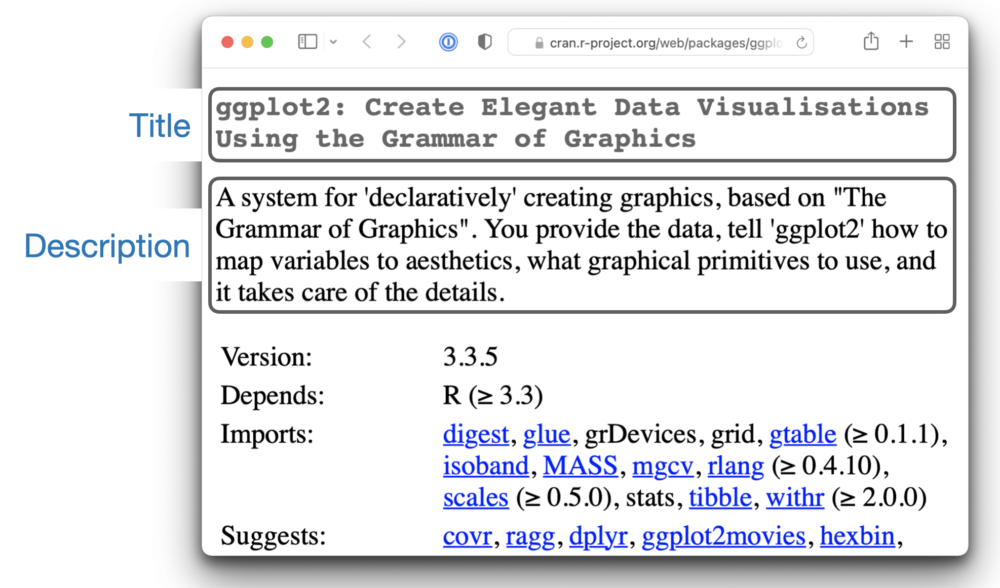

[[sec-description]]
= `+DESCRIPTION+`
:description: Aprenda a crear un paquete, la unidad fundamental de contenido compartible, reutilizable, y código R reproducible.
:lang: es

`+DESCRIPTION+` y `+NAMESPACE+` Hay dos archivos importantes que proporcionan metadatos sobre su paquete. El archivo `+DESCRIPTION+` proporciona metadatos generales sobre el paquete, como el nombre del paquete y de qué otros paquetes depende. El archivo `+NAMESPACE+` especifica qué funciones su paquete pone a disposición de otros para que las utilicen y, opcionalmente, importa funciones de otros paquetes.

En este capítulo, aprenderá sobre los campos más importantes que se encuentran en `+DESCRIPTION+`. Los dos capítulos siguientes cubren el tema de las dependencias de paquetes, que es donde quedará clara la importancia del archivo `+NAMESPACE+`. Primero, en <<sec-dependencies-mindset-background>>, analizamos los costos y beneficios de las dependencias y también proporcionamos el contexto técnico relevante sobre cómo R encuentra objetos. En <<sec-dependencies-in-practice>>, explicamos los movimientos prácticos necesarios para usar sus dependencias dentro de su paquete. La parte de metadatos del libro concluye con <<sec-license>>, que cubre las licencias.

== El archivo `+DESCRIPTION+`

El trabajo del archivo `+DESCRIPTION+` es almacenar metadatos importantes sobre su paquete. Cuando comience a escribir paquetes por primera vez, utilizará principalmente estos metadatos para registrar qué paquetes se necesitan para ejecutar su paquete. Sin embargo, a medida que pasa el tiempo, otros aspectos del archivo de metadatos le resultarán útiles, como revelar qué hace su paquete (a través del `+Título+`(`+Title+`) y la `+Descripción+`,`+Description+`) y con quién contactar (¡usted!) si hay algún problema. .

Cada paquete debe tener una `+DESCRIPTION+`. De hecho, es la característica que define un paquete (RStudio y devtools consideran que cualquier directorio que contenga `+DESCRIPTION+` es un paquete)footnote:[La relación entre "`tiene un archivo `+DESCRIPTION+``" y "`es un paquete`" no es tan clara. Muchos proyectos que no son paquetes usan un archivo `+DESCRIPTION+` para declarar sus dependencias, es decir, en qué paquetes dependen. De hecho, ¡el proyecto de este libro hace exactamente eso! Este uso no autorizado de `+DESCRIPTION+` facilita el uso de herramientas de desarrollo de paquetes para instalar todos los paquetes necesarios para trabajar con un proyecto que no es un paquete.]. Para comenzar, `+usethis::create_package("mypackage")+` agrega automáticamente un archivo básico `+DESCRIPTION+`. Esto le permitirá comenzar a escribir el paquete sin tener que preocuparse por los metadatos hasta que sea necesario. Esta descripción mínima variará un poco dependiendo de su configuración, pero debería verse así:

[source,yaml,yaml,cell-code]
----
Package: mypackage
Title: What the Package Does (One Line, Title Case)
Version: 0.0.0.9000
Authors@R: 
    person("First", "Last", , "first.last@example.com", role = c("aut", "cre"),
           comment = c(ORCID = "YOUR-ORCID-ID"))
Description: What the package does (one paragraph).
License: `use_mit_license()`, `use_gpl3_license()` or friends to pick a
    license
Encoding: UTF-8
Roxygen: list(markdown = TRUE)
RoxygenNote: 7.3.1
----

Si crea muchos paquetes, puede personalizar el contenido predeterminado de los nuevos archivos `+DESCRIPTION+` configurando la opción global `+usethis.description+` en una lista con nombre. Puede preconfigurar su nombre preferido, correo electrónico, licencia, etc. Consulte el https://usethis.r-lib.org/articles/articles/usethis-setup.html[artículo sobre cómo usar esta configuración] para obtener más detalles.

`+DESCRIPTION+` utiliza un formato de archivo simple llamado DCF, el formato de control de Debian. Puede ver la mayor parte de la estructura en los ejemplos de este capítulo. Cada línea consta de un nombre de *campo* y un valor, separados por dos puntos. Cuando los valores abarcan varias líneas, es necesario sangrarlos:

[source,yaml]
----
Description: La descripción de un paquete suele abarcar varias líneas.
    La segunda línea y las siguientes deben tener sangría, generalmente con cuatro
    espacios.
----

Si alguna vez necesita trabajar con un archivo `+DESCRIPTION+` mediante programación, eche un vistazo al [paquete desc] (https://desc.r-lib.org/), que utiliza este archivo en gran medida de forma oculta.

Este capítulo le muestra cómo utilizar los campos más importantes de `+DESCRIPTION+`.

[[sec-description-title-and-description]]
== `+Title+` y `+Description+`: ¿Qué hace tu paquete?

Los campos `+Title+` y `+Description+` describen lo que hace el paquete. Se diferencian sólo en longitud:

* `+Title+` es una descripción de una línea del paquete y, a menudo, se muestra en una lista de paquetes. Debe ser texto sin formato (sin marcas), en mayúscula como un título y NO terminar en un punto. Sea breve: los listados a menudo truncarán el título a 65 caracteres.
* `+Description+` Es más detallado que el título. Puede utilizar varias oraciones, pero está limitado a un párrafo. Si su descripción abarca varias líneas (¡y debería hacerlo!), cada línea no debe tener más de 80 caracteres de ancho. Sangra las líneas siguientes con 4 espacios.

Los campos `+Title+` y `+Description+` para el paquete ggplot2 son:

[source,yaml]
----
Title: Create Elegant Data Visualisations Using the Grammar of Graphics
Description: A system for 'declaratively' creating graphics,
    based on "The Grammar of Graphics". You provide the data, tell 'ggplot2'
    how to map variables to aesthetics, what graphical primitives to use,
    and it takes care of the details.
----

Un buen título y descripción son importantes, especialmente si planea liberar su paquete a CRAN, porque aparecen en la página de inicio de CRAN del paquete como se muestra en <<fig-cran-package-page>>:

.Cómo aparecen el título y la descripción en la página CRAN de ggplot2.
[#fig-cran-package-page]

[WARNING]
.Envío a CRAN
====
Tanto el "`Título`" como la "`Descripción`" son una fuente frecuente de rechazos por motivos no cubiertos por la "`verificación R CMD`" automatizada. Además de los conceptos básicos anteriores, aquí hay algunos consejos más:

* Coloque los nombres de los paquetes, el software y las API de R entre comillas simples. Esto se aplica tanto al título como a la descripción. Vea el ejemplo de ggplot2 anterior.
* Si necesita utilizar un acrónimo, intente hacerlo en `+Description+`, no en `+Títle+`. En cualquier caso, explique el acrónimo en `+Description+`, es decir, expándalo por completo.
* No incluya el nombre del paquete, especialmente en `+Títle+`, que a menudo tiene el prefijo del nombre del paquete.
* No empiece con "`Un paquete para…`" o "`Este paquete hace…`". Esta regla tiene sentido una vez que miras https://cran.r-project.org/web/packages/available_packages_by_name.html[la lista de paquetes CRAN por nombre]. La densidad de información de un listado de este tipo es mucho mayor sin un prefijo universal como "`Un paquete para …`".

Si estas limitaciones le provocan un bloqueo, a menudo resulta útil dedicar unos minutos a leer el título y la descripción de los paquetes que ya están en CRAN. Una vez que lea un par de docenas, generalmente podrá encontrar una manera de decir lo que quiere decir sobre su paquete que probablemente también pase las comprobaciones realizadas por humanos de CRAN.

====

Notarás que `+Description+` solo te brinda una pequeña cantidad de espacio para describir lo que hace tu paquete. Por eso es tan importante incluir también un archivo `+README.md+` que profundiza mucho más y muestra algunos ejemplos. Aprenderás sobre eso en <<sec-readme>>.

[[sec-description-authors-at-r]]
== Autor: ¿quién eres?

Utilice el campo `+Authors@R+` para identificar al autor del paquete y a quién contactar si algo sale mal. Este campo es inusual porque contiene código R ejecutable en lugar de texto sin formato. He aquí un ejemplo:

[source,yaml]
----
Authors@R: person("Hadley", "Wickham", email = "hadley@posit.co",
  role = c("aut", "cre"))
----

[source,r,cell-code]
----
person("Hadley", "Wickham", email = "hadley@posit.co", 
  role = c("aut", "cre"))
#> [1] "Hadley Wickham <hadley@posit.co> [aut, cre]"
----

Este comando dice que Hadley Wickham es tanto el mantenedor (`+cre+`) como el autor (`+aut+`) y que su dirección de correo electrónico es `+hadley@posit.co+`. La función `+person()+` tiene cuatro entradas principales:

* El nombre, especificado por los dos primeros argumentos, `+given+` y `+family+` (normalmente se proporcionan por posición, no por nombre). En las culturas inglesas, `+given+` (nombre) viene antes de `+family+` (apellido). En muchas culturas, esta convención no se cumple. Para una entidad que no sea una persona, como "`R Core Team`" o "`Posit Software, PBC`", utilice el argumento `+given+` (y omita `+family+`).
* La dirección de `+email+`, que es sólo un requisito absoluto para el mantenedor. Es importante tener en cuenta que esta es la dirección que CRAN utiliza para informarle si su paquete necesita ser reparado para permanecer en CRAN. Asegúrese de utilizar una dirección de correo electrónico que probablemente exista por un tiempo. La política de CRAN requiere que esto sea para una persona, a diferencia de, por ejemplo, una lista de correo.
* Uno o más códigos de tres letras que especifican el "`rol`". Estos son los roles más importantes que debes conocer:
** `+cre+`: el creador o mantenedor, la persona a la que debes molestar si tienes problemas. A pesar de ser la abreviatura de "`creador`", este es el rol correcto que debe utilizar el mantenedor actual, incluso si no es el creador inicial del paquete.
** `+aut+`: autores, aquellos que han hecho contribuciones significativas al paquete.
** `+ctb+`: contribuyentes, aquellos que han hecho contribuciones menores, como parches.
** `+cph+`: titular de derechos de autor. Esto se utiliza para enumerar titulares de derechos de autor adicionales que no son autores, generalmente empresas, como un empleador de uno o más de los autores.
** `+fnd+`: financiador, las personas u organizaciones que han proporcionado apoyo financiero para el desarrollo del paquete.
* El argumento opcional `+comment+` se ha vuelto más relevante, ya que `+person()+` y las páginas de inicio de CRAN han adquirido algunas características interesantes en torno al https://orcid.org[identificador ORCID]. A continuación se muestra un ejemplo de dicho uso (tenga en cuenta el URI generado automáticamente):
+
[source,r,cell-code]
----
person(
  "Jennifer", "Bryan",
  email = "jenny@posit.co",
  role = c("aut", "cre"),
  comment = c(ORCID = "0000-0002-6983-2759")
)
#> [1] "Jennifer Bryan <jenny@posit.co> [aut, cre] (<https://orcid.org/0000-0002-6983-2759>)"
----

Puede enumerar varios autores con `+c()+`:

[source,yaml]
----
Authors@R: c(
    person("Hadley", "Wickham", email = "hadley@posit.co", role = "cre"),
    person("Jennifer", "Bryan", email = "jenny@posit.co", role = "aut"),
    person("Posit Software, PBC", role = c("cph", "fnd")))
----

Cada paquete debe tener al menos un autor (`+aut+`) y un mantenedor (`+cre+`) (pueden ser la misma persona). El mantenedor (`+cre+`) debe tener una dirección de correo electrónico. Estos campos se utilizan para generar la cita básica para el paquete (por ejemplo, `+citation("pkgname")+`). Solo las personas que figuran como autores se incluirán en la cita generada automáticamente (<<sec-misc-inst-citation>>). Hay algunos detalles adicionales si incluye código que otras personas han escrito, sobre los cuales puede obtener información en <<sec-code-you-bundle>>.

Un enfoque más antiguo, aún válido, es tener campos separados `+Maintainer+` y `+Author+` en `+DESCRIPTION+`. Sin embargo, recomendamos encarecidamente el enfoque más moderno de `+Authors@R+` y la función `+person()+`, porque ofrece metadatos más ricos para diversos usos posteriores..

== `+URL+` y `+BugReports+`

Además de la dirección de correo electrónico del mantenedor, es una buena idea enumerar otros lugares donde las personas pueden obtener más información sobre su paquete. El campo `+URL+` se usa comúnmente para anunciar el sitio web del paquete (<<sec-website>>) y para vincular a un repositorio de código fuente público, donde se lleva a cabo el desarrollo. Varias URL están separadas por una coma. `+BugReports+` es la URL donde se deben enviar los informes de errores, por ejemplo, como problemas de GitHub. Por ejemplo, devtools tiene:

[source,yaml]
----
URL: https://devtools.r-lib.org/, https://github.com/r-lib/devtools
BugReports: https://github.com/r-lib/devtools/issues
----

Si usa `+usethis::use_github()+` para conectar su paquete local a un repositorio remoto de GitHub, automáticamente completará `+URL+` y `+BugReports+`. Si un paquete ya está conectado a un repositorio remoto de GitHub, se puede llamar a `+usethis::use_github_links()+` para simplemente agregar los enlaces relevantes a `+DESCRIPTION+`.

== El campo `+License+`

El campo `+License+` es obligatorio y debe especificar la licencia de su paquete en un formulario estándar reconocido por R. Las herramientas oficiales tienen como objetivo identificar licencias estándar de código abierto, por lo que es importante tener en cuenta que `+License+` es básicamente un campo legible por máquina. Consulte <<sec-license>> para obtener una discusión completa.

[[sec-description-imports-suggests]]
== `+Imports+`, `+Suggests+`, y amigos

Dos de los campos más importantes y comunmente usados de `+DESCRIPTION+` son `+Imports+` y `+Suggests+`, que enumera otros paquetes de los que depende su paquete. Los usuarios necesitan los paquetes enumerados en `+Imports+` en tiempo de ejecución y se instalarán (o potencialmente actualizarán) cuando los usuarios instalen su paquete a través de `+install.packages()+`. Las siguientes líneas indican que su paquete necesita absolutamente tanto dplyr como tidyr para funcionar.

[source,yaml]
----
Imports:
    dplyr,
    tidyr
----

Los paquetes enumerados en `+Suggests+` son necesarios para tareas de desarrollo o pueden desbloquear funciones opcionales para sus usuarios. Las líneas siguientes indican que, si bien su paquete puede aprovechar ggplot2 y testthat, no son absolutamente necesarios:

[source,yaml]
----
Suggests:
    ggplot2,
    testthat
----

Tanto `+Imports+` como `+Suggests+` toman una lista de nombres de paquetes separados por comas. Recomendamos poner un paquete en cada línea y mantenerlos en orden alfabético. Un orden no aleatorio facilita que los humanos analicen este campo y aprecien los cambios.

La forma más sencilla de agregar un paquete a `+Imports+` o `+Suggests+` es con `+usethis::use_package()+`. Si las dependencias ya están en orden alfabético, `+use_package()+` las mantendrá así. En general, puede ser bueno ejecutar `+usethis::use_tidy_description()+` regularmente, que ordena y formatea los campos `+DESCRIPTION+` de acuerdo con un estándar fijo.

Si agrega paquetes a `+DESCRIPTION+` con `+usethis::use_package()+`, también le recordará la forma recomendada de llamarlos (explicada más en <<sec-dependencies-in-practice>>).

[source,r,cell-code]
----
usethis::use_package("dplyr") # El valor predeterminado es "Imports"
#> ✔ Adding 'dplyr' to Imports field in DESCRIPTION
#> • Refer to functions with `dplyr::fun()`

usethis::use_package("ggplot2", "Suggests")
#> ✔ Adding 'ggplot2' to Suggests field in DESCRIPTION
#> • Use `requireNamespace("ggplot2", quietly = TRUE)` to test if package is installed
#> • Then directly refer to functions with `ggplot2::fun()`
----

[[sec-description-imports-suggests-minium-version]]
=== Versiones mínimas

Si necesita una versión específica de un paquete, especifíquela entre paréntesis después del nombre del paquete:

[source,yaml]
----
Imports:
    dplyr (>= 1.0.0),
    tidyr (>= 1.1.0)
----

La conveniente función `+usethis::use_package()+` también le ayuda a establecer una versión mínima:

[source,r,cell-code]
----
# versión exacta
usethis::use_package("dplyr", min_version = "1.0.0")

# versión mínima = versión actualmente instalada
usethis::use_package("dplyr", min_version = TRUE)
----

Siempre querrás especificar una versión mínima (`+dplyr (>= 1.0.0)+`) en lugar de una versión exacta (`+dplyr (== 1.0.0)+`). Dado que R no puede tener varias versiones del mismo paquete cargadas al mismo tiempo, especificar una dependencia exacta aumenta drásticamente la posibilidad de que haya versiones en conflicto footnote:[La necesidad de especificar las versiones exactas de los paquetes, en lugar de las versiones mínimas, surge con más frecuencia en el desarrollo de proyectos que no son paquetes. El https://rstudio.github.io/renv/[paquete renv] proporciona una manera de hacer esto, mediante la implementación de entornos específicos del proyecto (bibliotecas de paquetes). renv es un reinicio de un paquete anterior llamado packrat. Si desea congelar las dependencias de un proyecto en versiones exactas, use renv en lugar de (o posiblemente además de) un archivo `+DESCRIPTION+`.].

El control de versiones es más importante si va a liberar su paquete para que otros lo utilicen. Por lo general, la gente no tiene exactamente las mismas versiones de paquetes instaladas que usted. Si alguien tiene un paquete anterior que no tiene una función que su paquete necesita, recibirá un mensaje de error inútil si su paquete no anuncia la versión mínima que necesita. Sin embargo, si indica una versión mínima, obtendrán automáticamente una actualización cuando instalen su paquete.

Piense detenidamente si declara una versión mínima para una dependencia. En cierto sentido, lo más seguro es requerir una versión mayor o igual a la versión actual del paquete. Para trabajos públicos, esto se define más naturalmente como la versión CRAN actual de un paquete; Los proyectos privados o personales podrán adoptar algún otro convenio. Pero es importante apreciar las implicaciones para las personas que intentan instalar su paquete: si su instalación local no cumple con todos sus requisitos en torno a las versiones, la instalación forzará las actualizaciones de estas dependencias. Esto es deseable si sus requisitos mínimos de versión son genuinos, es decir, de lo contrario su paquete estaría roto. Pero si los requisitos establecidos tienen una justificación menos sólida, esto puede resultar innecesariamente conservador e inconveniente.

En ausencia de requisitos claros y estrictos, debe establecer versiones mínimas (o no) en función de su base de usuarios esperada, las versiones de paquetes que probablemente tengan y un análisis de costo-beneficio para determinar si es demasiado laxo o demasiado conservador. La política _de facto_ del equipo de tidyverse es especificar una versión mínima cuando se utiliza una característica nueva conocida o cuando alguien encuentra un problema de versión en uso auténtico. Esto no es perfecto, pero actualmente no contamos con las herramientas para hacerlo mejor y parece funcionar bastante bien en la práctica.

=== `+Depends+` y `+LinkingTo+`

Hay otros tres campos que le permiten expresar dependencias más especializadas:

* `+Depends+`: Antes de la implementación de espacios de nombres en R 2.14.0 en 2011, `+Depends+` era la única forma de "`depender`" de otro paquete. Ahora bien, a pesar del nombre, casi siempre deberías usar `+Imports+`, no `+Depends+`. Aprenderá por qué y cuándo debería seguir usándo `+Depends+`, en <<sec-dependencies-imports-vs-depends>>.
+
El uso actual más legítimo de `+Depends+` es indicar una versión mínima para el propio R, p. `+Depends: R (>= 4.0.0)+`. Nuevamente, piense detenidamente si hace esto. Esto plantea los mismos problemas que establecer una versión mínima para un paquete del que depende, excepto que lo que está en juego es mucho mayor cuando se trata del propio R. Los usuarios no pueden simplemente dar su consentimiento para la actualización necesaria, por lo que, si otros paquetes dependen del suyo, su requisito de versión mínima para R puede causar una cascada de fallas en la instalación de paquetes.
** El https://cran.r-project.org/package=backports[paquete backports] es útil si desea utilizar una función como `+tools::R_user_dir()+`, que se introdujo en 4.0.0 en 2020, sin dejar de ser compatible con versiones anteriores de R.
** Los paquetes tidyverse son oficialmente compatibles con la versión R actual, la versión devel y cuatro versiones anteriores.footnote:[Vea esta publicación de blog para más: https://www.tidyverse.org/blog/2019/04/r-version-support/.] Probamos proactivamente este soporte en la matriz de compilación estándar que utilizamos para la integración continua.
** Es posible que los paquetes con un nivel de uso inferior no necesiten este nivel de rigor. La conclusión principal es: si declara un mínimo de R, debe tener una razón y debe tomar medidas razonables para probar su afirmación con regularidad.
* `+LinkingTo+`: Si su paquete usa código C o C++ de otro paquete, debe incluirlo aquí.
* `+Enhances+`: Los paquetes enumerados aquí están "`mejorados`" por su paquete. Normalmente, esto significa que proporcionas métodos para clases definidas en otro paquete (una especie de `+Suggests+` inversas). Pero es difícil definir qué significa eso, por lo que no recomendamos usar `+Enhances+`.

=== Una versión R te pillé

Antes de abandonar este tema, damos un ejemplo concreto de la facilidad con la que una dependencia de la versión R puede aparecer y tener un impacto más amplio de lo que cabría esperar. La función `+saveRDS()+` escribe un único objeto R como un archivo `+.rds+`, un formato específico de R. Durante casi 20 años, los archivos `+.rds+` utilizaron el formato de serialización "`versión 2`". La "`Versión 3`" se convirtió en la nueva versión predeterminada en R 3.6.0 (lanzada en abril de 2019) y no puede leerse en las versiones de R anteriores a la 3.5.0 (lanzada en abril de 2018).

Muchos paquetes de R tienen al menos un archivo `+.rds+` escondido y, si se vuelve a generar con una versión moderna de R, de forma predeterminada, el nuevo archivo `+.rds+` tendrá el formato de "`versión 3`". La próxima vez que se compila ese paquete R, como para un envío CRAN, la versión R requerida pasa automáticamente a 3.5.0, como se indica con este mensaje:

[source,console]
----
NB: this package now depends on R (>= 3.5.0)
  WARNING: Added dependency on R >= 3.5.0 because serialized objects in
  serialize/load version 3 cannot be read in older versions of R.
  File(s) containing such objects:
    'path/to/some_file.rds'
----

Literalmente, el archivo `+DESCRIPTION+` en el paquete incluido dice `+DependS: R (>= 3.5.0)+`, incluso si `+DESCRIPTION+` en el paquete fuente dice lo contrariofootnote:[Los diferentes estados del paquete, como fuente o empaquetado, se explican en <<sec-package-states>>.].

Cuando un paquete de este tipo se publica en CRAN, la nueva versión mínima de R es viral, en el sentido de que todos los paquetes que enumeran el paquete original en `+Imports+` o incluso en `+Suggests+` han heredado, en diversos grados, la nueva dependencia de R >= 3.5.0.

La conclusión inmediata es ser muy deliberado acerca de la versión de los archivos `+.rds+` hasta que las versiones R anteriores a 3.5.0 hayan caído del límite de lo que pretende admitir. Este problema particular de `+.rds+` no estará con nosotros para siempre, pero problemas similares surgen en otros lugares, como en los estándares implícitos en el código fuente compilado de C o C++. El mensaje más amplio es que cuantas más dependencias inversas tenga su paquete, más pensará en las versiones mínimas indicadas de su paquete, especialmente para R.

== Otros campos

Algunos otros campos `+DESCRIPTION+` se utilizan mucho y vale la pena conocerlos:

* `+Version+` Es muy importante como forma de comunicar en qué punto de su ciclo de vida se encuentra su paquete y cómo evoluciona con el tiempo. Más información en <<sec-lifecycle>>.
* `+LazyData+` es relevante si su paquete pone datos a disposición del usuario. Si especifica `+LazyData: true+`, los conjuntos de datos se cargan de forma diferida, lo que los hace disponibles más inmediatamente, es decir, los usuarios no tienen que usar `+data()+`. La adición de `+LazyData: true+` se maneja automáticamente mediante `+usethis::use_data()+`. Se dan más detalles en <<sec-data>>.
* `+Encoding+` describe la codificación de caracteres de los archivos en todo el paquete. Nuestras herramientas establecerán esto en `+Encoding: UTF-8+`, ya que esta es la codificación más común que se usa hoy en día y no conocemos ninguna razón para usar un valor diferente.
* `+Collate+` controla el orden en el que se obtienen los archivos R. Esto sólo importa si su código tiene efectos secundarios; más comúnmente porque estás usando S4. Si es necesario, roxygen2 normalmente genera `+Collate+` mediante el uso de la etiqueta `+@include+`. Consulte `+?roxygen2::update_collate+` para obtener más detalles.
* `+VignetteBuilder+` incluye cualquier paquete que su paquete necesite como motor de viñeta. Nuestro flujo de trabajo de viñeta recomendado se describe en <<sec-vignettes-workflow-writing>>, que enumerará el paquete knitr en `+VignetteBuilder+`.
* `+SystemRequirements+` es donde describe las dependencias externas a R. Este es un campo de texto sin formato y, por ejemplo, en realidad no instala ni verifica nada, por lo que es posible que deba incluir detalles de instalación adicionales en su archivo README (<<sec-readme>>). El uso más común es en el contexto de un paquete con código compilado, donde se usa `+SystemRequirements+` para declarar el estándar C++, la necesidad de crear GNU o alguna otra dependencia externa. Ejemplos:
+
[source,yaml]
----
SystemRequirements: C++17
SystemRequirements: GNU make
SystemRequirements: TensorFlow (https://www.tensorflow.org/
----

No recomendamos el uso explícito del campo `+Date+`, ya que es muy fácil olvidarse de actualizarlo si administra la fecha manualmente. Este campo se completará en el curso natural de agrupar el paquete, p. al enviar a CRAN, y le recomendamos que deje que eso suceda.

Hay muchos otros campos de descripción que se utilizan con menos frecuencia. Puede encontrar una lista completa en la sección "`El archivo DESCRIPTION`" de https://cran.r-project.org/doc/manuals/R-exts.html#The-DESCRIPTION-file[Escribir extensiones R].

[[sec-description-custom-fields]]
== Campos Personalizados

También existe cierta flexibilidad para crear sus propios campos para agregar metadatos adicionales. En el sentido más estricto, la única restricción es que no debes reutilizar los nombres de campos oficiales utilizados por R. También debe limitarse a palabras válidas en inglés, para que el corrector ortográfico no marque los nombres de los campos.

En la práctica, si planea enviar a CRAN, le recomendamos que cualquier nombre de campo personalizado comience con `+Config/+`. Revisaremos esto más adelante cuando expliquemos cómo se usa `+Config/Needs/website+` para registrar paquetes adicionales necesarios para crear el sitio web de un paquete (<<sec-dependencies-nonstandard>>).

Podrías notar que `+create_package()+` escribe dos campos más que aún no hemos discutido, relacionados con el uso del paquete roxygen2 para documentación:

[source,yaml]
----
Roxygen: list(markdown = TRUE)
RoxygenNote: 7.2.1
----

Aprenderá más sobre estos en <<sec-man>>. El uso de estos nombres de campos específicos es básicamente un accidente de la historia y, si se volviera a hacer hoy, seguirían el patrón `+Config/*+` recomendado anteriormente.
