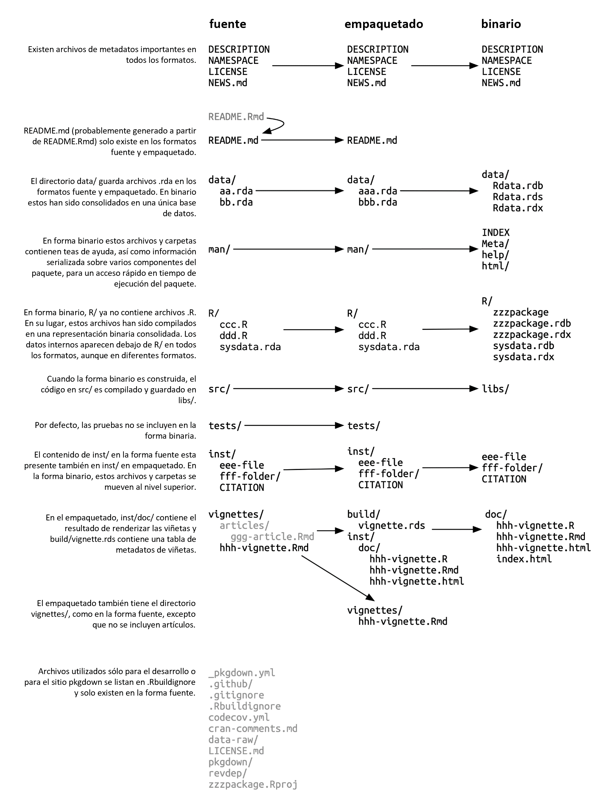
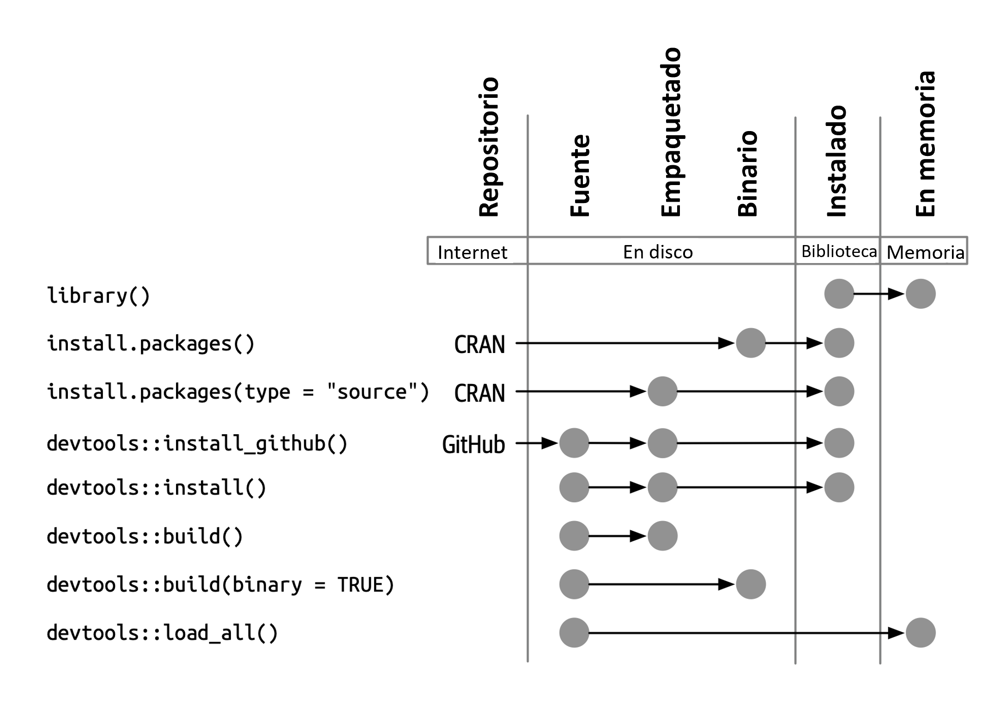

[[sec-package-structure-state]]
= Estructura y estado del paquete
:description: Aprenda a crear un paquete, la unidad fundamental de contenido compartible, reutilizable, y código R reproducible.
:lang: es

Este capítulo lo iniciará en el camino hacia el desarrollo de paquetes al convertir el conocimiento implícito que ha obtenido al _usar_ paquetes R en el conocimiento explícito necesario para _crearlos y modificarlos_. Aprenderá sobre los distintos estados en los que puede encontrarse un paquete y la diferencia entre un paquete y una biblioteca (y por qué debería importarle).

[[sec-package-states]]
== Estados del paquete

Cuando crea o modifica un paquete, trabaja en su "`código fuente`" o "`archivos fuente`". Interactúa con el paquete en desarrollo en su formato *fuente*. Este NO es el formato de paquete con el que está más familiarizado con el uso diario. Los flujos de trabajo de desarrollo de paquetes tienen mucho más sentido si comprende los cinco estados en los que puede encontrarse un paquete R:

* fuente
* empaquetado
* binario
* instalado
* en memoria

Ya conoces algunas de las funciones que ponen paquetes en estos estados. Por ejemplo, `+install.packages()+` puede mover un paquete desde el estado fuente, empaquetado o binario al estado instalado. `+devtools::install_github()+` toma un paquete fuente en GitHub y lo mueve al estado instalado. La función `+library()+` carga un paquete instalado en la memoria, haciéndolo disponible para uso inmediato y directo.

[[sec-source-package]]
== Paquete fuente

Un paquete *fuente* es solo un directorio de archivos con una estructura específica. Incluye componentes particulares, como un archivo `+DESCRIPTION+`, un directorio `+R/+` que contiene archivos `+.R+`, etc. La mayoría de los capítulos restantes de este libro están dedicados a detallar estos componentes.

Si es nuevo en el desarrollo de paquetes, es posible que nunca haya visto un paquete en formato fuente. Es posible que ni siquiera tengas ningún paquete fuente en tu computadora. La forma más sencilla de ver un paquete en su formato fuente de inmediato es explorar su código en la web.

Muchos paquetes de R se desarrollan abiertamente en GitHub (o GitLab o similar). El mejor de los casos es que visite la página de inicio de CRAN del paquete, por ejemplo:

* forcats: https://cran.r-project.org/package=forcats
* readxl: https://cran.r-project.org/package=readxl

y una de sus URL enlaza a un repositorio en un servicio de alojamiento público, por ejemplo:

* forcats: https://github.com/tidyverse/forcats
* readxl: https://github.com/tidyverse/readxl

Algunos mantenedores olvidan incluir esta URL, aunque el paquete se desarrolle en un repositorio público, pero aún así es posible que puedas descubrirlo mediante la búsqueda.

Incluso si un paquete no está desarrollado en una plataforma pública, puede visitar su fuente en el https://docs.r-hub.io/#cranatgh[Espejo no oficial de solo lectura mantenido por R-hub]. Ejemplos:

* MASS: https://github.com/cran/MASS
* car: https://github.com/cran/car

Tenga en cuenta que explorar la fuente y el historial de un paquete dentro de la organización GitHub `+cran+` no es lo mismo que explorar el verdadero lugar de desarrollo del paquete, porque esta fuente y su evolución simplemente son ingeniería inversa de las versiones CRAN del paquete. Esto presenta una vista redactada del paquete y su historia, pero, por definición, incluye todo lo que es esencial.

[[sec-bundled-package]]
== Paquete empaquetado

Un paquete *empaquetado* es un paquete que se ha comprimido en un solo archivo. Por convención (de Linux), los paquetes de paquetes en R usan la extensión `+.tar.gz+` y, a veces, se denominan "`tarballs de origen`". Esto significa que varios archivos se han reducido a un solo archivo (`+.tar+`) y luego se han comprimido usando gzip (`+.gz+`). Si bien un paquete empaquetado no es tan útil por sí solo, es un intermediario independiente de la plataforma y fácil de transportar entre un paquete fuente y un paquete instalado.

En el raro caso de que necesites crear un paquete empaquetado a partir de un paquete que estás desarrollando localmente, usa `+devtools::build()+`. En el fondo, esto llama a `+pkgbuild::build()+` y, en última instancia, a `+R CMD build+`, que se describe con más detalle en la sección https://cran.r-project.org/doc/manuals/R-exts.html#Building-package-tarballs[Creación de paquetes empaquetados] de https://cran.r-project.org/doc/manuals/R-exts.html[Escribir extensiones de R].

Esto debería indicarle que un paquete de paquetes o "`tarball fuente`" no es simplemente el resultado de crear un archivo tar de los archivos fuente y luego comprimirlos con gzip. Por convención, en el mundo R, se llevan a cabo algunas operaciones más al crear el archivo `+.tar.gz+` y es por eso que hemos elegido referirnos a esta forma como un paquete *empaquetado*, en este libro.

Cada paquete CRAN está disponible en forma de empaquetada, a través del campo "`Fuente del paquete`" de su página de inicio. Continuando con nuestros ejemplos anteriores, puede descargar los empaquetados `+forcats_0.4.0.tar.gz+` y `+readxl_1.3.1.tar.gz+` (o cualesquiera que sean las versiones actuales). Podrías descomprimir dicho empaquetado en el shell (no en la consola R) de esta manera:

[source,bash]
----
tar xvf forcats_0.4.0.tar.gz
----

Si descomprimes un empaquetado, verás que se ve casi igual que un paquete fuente. <<fig-package-files>> muestra los archivos presentes en las formas fuente, empaquetada y binaria de un paquete ficticio llamado zzzpackage. Hemos elaborado deliberadamente este ejemplo para incluir la mayoría de las partes del paquete que se tratan en este libro. No todos los paquetes incluirán todos los archivos que se ven aquí, ni este diagrama incluye todos los archivos posibles que puedan aparecer en un paquete.

.Formas de paquete: fuente versus empaquetado versus binario.
[#fig-package-files]

Las principales diferencias entre un paquete fuente y un paquete sin comprimir son:

* Se han creado viñetas, por lo que los resultados renderizados, como HTML, aparecen debajo de `+inst/doc/+` y aparece un índice de viñetas en el directorio `+build/+`.
* Un paquete fuente local puede contener archivos temporales utilizados para ahorrar tiempo durante el desarrollo, como artefactos de compilación en `+src/+`. Estos nunca se encuentran en un empaquetado.
* Todos los archivos enumerados en `+.Rbuildignore+` no están incluidos en el empaquetado. Suelen ser archivos que facilitan el proceso de desarrollo, pero que deben excluirse del producto distribuido.

[[sec-rbuildignore]]
=== `+.Rbuildignore+`

No necesitará contemplar la estructura exacta de los archivos del paquete `+.tar.gz+` con mucha frecuencia, pero sí necesitará comprender el archivo `+.Rbuildignore+`. Controla qué archivos del paquete fuente llegan a las formas posteriores.

Cada línea de `+.Rbuildignore+` es una expresión regular compatible con Perl que coincide, sin importar mayúsculas y minúsculas, con la ruta a cada archivo en el paquete fuentefootnote:[Para ver el conjunto de rutas de archivos que deberían estar en su radar, ejecute `+dir(full.names = TRUE, recursive = TRUE, include.dirs = TRUE, all.files = TRUE)+` en el directorio de nivel superior del paquete.]. Si la expresión regular coincide, ese archivo o directorio se excluye. Tenga en cuenta que existen algunas exclusiones predeterminadas implementadas por el propio R, en su mayoría relacionadas con editores y sistemas de control de versiones clásicos, como SVN, Git y Emacs.

Generalmente modificamos `+.Rbuildignore+` con la función `+usethis::use_build_ignore()+`, que se encarga de detalles fáciles de olvidar, como el anclaje y el escape de expresiones regulares. Para excluir un archivo o directorio específico (el caso de uso más común), *DEBE* anclar la expresión regular. Por ejemplo, para excluir un directorio llamado "`notas`", la entrada `+.Rbuildignore+` debe ser `+^notas$+`, mientras que la expresión regular no anclada `+notas+` coincidirá con cualquier nombre de archivo que contenga "`notas`", p. `+R/notas.R+`, `+man/important-notas.R+`, `+data/notasfinales.Rdata+`, etc. Descubrimos que `+use_build_ignore()+` nos ayuda a obtener más entradas de `+.Rbuildignore+` correctamente la primera vez.

`+.Rbuildignore+` es una forma de resolver parte de la tensión entre las prácticas que respaldan su proceso de desarrollo y los requisitos de CRAN para el envío y la distribución (<<sec-release>>). Incluso si no planea publicar en CRAN, seguir estas convenciones le permitirá hacer el mejor uso de las herramientas integradas de R para la verificación e instalación de paquetes. Los archivos que debe `+.Rbuildignore+` se dividen en dos clases amplias y semisuperpuestas:

* Archivos que le ayudan a generar contenidos de paquetes mediante programación. Ejemplos:
** Usando `+README.Rmd+` para generar un archivo informativo y actual `+README.md+` (<<sec-readme>>).
** Almacenamiento de scripts `+.R+` para crear y actualizar datos internos o exportados (<<sec-data-data-raw>>).
* Archivos que impulsan el desarrollo, la verificación y la documentación de paquetes, fuera del ámbito de CRAN. Ejemplos:
** Archivos relacionados con el IDE de RStudio (<<sec-workflow101-rstudio-projects>>).
** Usar el paquete https://pkgdown.r-lib.org[pkgdown] para generar un sitio web (<<sec-website>>).
** Archivos de configuración relacionados con la integración/implementación continua (<<sec-sw-dev-practices-ci>>).

Aquí hay una lista no exhaustiva de entradas típicas en el archivo `+.Rbuildignore+` para un paquete en tidyverse.:

....
^.*\.Rproj$         # Designa el directorio como un proyecto RStudio
^\.Rproj\.user$     # Utilizado por RStudio para archivos temporales
^README\.Rmd$       # Un archivo Rmd utilizado para generar README.md
^LICENSE\.md$       # Texto completo de la licencia.
^cran-comments\.md$ # Comentarios para el envío de CRAN
^data-raw$          # Código utilizado para crear datos incluidos en el paquete.
^pkgdown$           # Recursos utilizados para el sitio web del paquete.
^_pkgdown\.yml$     # Información de configuración para el sitio web del paquete.
^\.github$          # Flujos de trabajo de acciones de GitHub
....

Tenga en cuenta que los comentarios anteriores no deben aparecer en un archivo `+.Rbuildignore+` real; se incluyen aquí sólo para exposición.

Mencionaremos cuándo necesita agregar archivos a `+.Rbuildignore+` siempre que sea importante. Recuerde que `+usethis::use_build_ignore()+` es una forma atractiva de administrar este archivo. Además, muchas funciones de usethis que agregan un archivo que debería aparecer en `+.Rbuildignore+` se encargan de esto automáticamente. Por ejemplo, `+use_readme_rmd()+` añade "`^README\.Rmd$`" a `+.Rbuildignore+`.

[[sec-structure-binary]]
== Paquete binario

Si desea distribuir su paquete a un usuario de R que no tiene herramientas de desarrollo de paquetes, deberá proporcionar un paquete *binario*. El principal fabricante y distribuidor de paquetes binarios es CRAN, no los mantenedores individuales. Pero incluso si delega la responsabilidad de distribuir su paquete a CRAN, sigue siendo importante que el mantenedor comprenda la naturaleza de un paquete binario.

Al igual que un paquete empaquetado, un paquete binario es un único archivo. A diferencia de un paquete empaquetado, un paquete binario es específico de la plataforma y hay dos versiones básicas: Windows y macOS. (Los usuarios de Linux generalmente deben tener las herramientas necesarias para instalar desde archivos `+.tar.gz+`, aunque la aparición de recursos como https://packagemanager.posit.co/[Posit Public Package Manager] está brindando a los usuarios de Linux el mismo acceso a paquetes binarios que sus colegas en Windows y macOS).

Los paquetes binarios para macOS se almacenan como `+.tgz+`, mientras que los paquetes binarios de Windows terminan en `+.zip+`. Si necesita crear un paquete binario, utilice `+devtools::build(binary = TRUE)+` en el sistema operativo correspondiente. En el fondo, esto llama a `+pkgbuild::build(binary = TRUE)+` y, en última instancia, a `+R CMD INSTALL --build+`, que se describe con más detalle en https://cran.r-%20project.org/doc/manuals/R-exts.html#Building-binary-packages[Creación de paquetes binarios] sección de [Escribir extensiones de R] (https://cran.r-project.org/doc/manuals/R-exts.html) . Si elige publicar su paquete en CRAN (<<sec-release>>), envía su paquete en forma de paquete, luego CRAN crea y distribuye los archivos binarios del paquete.

Los paquetes CRAN suelen estar disponibles en formato binario, tanto para macOS como para Windows, para las versiones actual, anterior y (posiblemente) de desarrollo de R. Continuando con nuestros ejemplos anteriores, puede descargar paquetes binarios como:

* forcats para macOS: `+forcats_0.4.0.tgz+`
* readxl para Windows: `+readxl_1.3.1.zip+`

y esto es, de hecho, parte de lo que normalmente sucede detrás de escena cuando llamas `+install.packages()+`.

Si descomprime un paquete binario, verá que la estructura interna es bastante diferente de la de un paquete fuente o empaquetado. <<fig-package-files>> incluye esta comparación, por lo que es un buen momento para revisar ese diagrama. Estas son algunas de las diferencias más notables:

* No hay archivos `+.R+` en el directorio `+R/+`; en su lugar, hay tres archivos que almacenan las funciones analizadas en un formato de archivo eficiente. Este es básicamente el resultado de cargar todo el código R y luego guardar las funciones con `+save()+`. (En el proceso, esto agrega algunos metadatos adicionales para hacer las cosas lo más rápido posible).
* Un directorio `+Meta/+` contiene varios archivos `+.rds+`. Estos archivos contienen metadatos almacenados en caché sobre el paquete, como los temas que cubren los archivos de ayuda y una versión analizada del archivo `+DESCRIPTION+`. (Puede usar `+readRDS()+` para ver exactamente qué hay en esos archivos). Estos archivos aceleran la carga de paquetes al almacenar en caché cálculos costosos.
* El contenido de la ayuda real aparece en `+help/+` y `+html/+` (ya no en `+man/+`).
* Si tenía algún código en el directorio `+src/+`, ahora habrá un directorio `+libs/+` que contiene los resultados de la compilación del código.
* Si tenía algún objeto en `+data/+`, ahora se ha convertido a una forma más eficiente.
* El contenido de `+inst/+` se mueve al directorio de nivel superior. Por ejemplo, los archivos de viñeta ahora están en `+doc/+`.
* Algunos archivos y carpetas se han eliminado, como `+README.md+`, `+build/+`, `+tests/+`, y `+vignettes/+`.

[[sec-installed-package]]
== Paquete instalado

Un paquete *instalado* es un paquete binario que se ha descomprimido en una biblioteca de paquetes (descrita en <<sec-library>>). <<fig-installation>> ilustra las muchas formas en que se puede instalar un paquete, junto con algunas otras funciones para convertir un paquete de un estado a otro. ¡Este diagrama es complicado! En un mundo ideal, instalar un paquete implicaría encadenar un conjunto de pasos simples: fuente -> empaquetado, empaquetado -> binario, binario -> instalado. En el mundo real, no es tan simple porque a menudo hay atajos (más rápidos) disponibles.

.Muchos métodos para convertir entre estados de paquetes.
[#fig-installation]

La herramienta de línea de comando incorporada `+R CMD INSTALL+` impulsa la instalación de todos los paquetes. Puede instalar un paquete a partir de archivos fuente, un paquete (también conocido como tarball fuente) o un paquete binario. Los detalles están disponibles en la https://cran.r-project.org/doc/manuals/R-admin.html#Installing-packages[sección Instalación de paquetes] de https://cran%20.r-project.org/doc/manuals/R-admin.html[Instalación y administración de R]. Al igual que con `+devtools::build()+`, devtools proporciona una función contenedora, `+devtools::install()+`, que hace que esta herramienta esté disponible desde una sesión de R.

[TIP]
.RStudio
====
RStudio también puede ayudarle a instalar su paquete en desarrollo a través de los menús desplegables _Install_ y _More_ en el panel _Build_ y con _Install Package_ en el menú _Build_.
====

Es comprensible que a la mayoría de los usuarios les guste instalar paquetes desde la comodidad de una sesión de R y directamente desde CRAN. La función incorporada `+install.packages()+` satisface esta necesidad. Puede descargar el paquete, en varias formas, instalarlo y, opcionalmente, atender la instalación de dependencias.

Sin embargo, la conveniencia de instalar paquetes R desde una sesión R tiene un precio. Como es de esperar, puede resultar un poco complicado reinstalar un paquete que ya está en uso en la sesión actual. En realidad, esto funciona la mayor parte del tiempo, pero a veces no, especialmente cuando se instala un paquete R con código compilado en Windows. Debido a la forma en que los identificadores de archivos están bloqueados en Windows, un intento de instalar una nueva versión de un paquete que está en uso puede resultar en una instalación corrupta donde el código R del paquete se actualizó, pero su código compilado no. Al solucionar problemas, los usuarios de Windows deben esforzarse por instalar los paquetes en una sesión R limpia, con la menor cantidad de paquetes cargados posible.

El paquete pak (https://pak.r-lib.org/) es relativamente nuevo (en el momento de escribir este capítulo) y proporciona una alternativa prometedora a `+install.packages()+`, así como a otras funciones más especializadas como `+devtools::install_github()+`. Es demasiado pronto para hacer una recomendación general sobre el uso de pak para todas sus necesidades de instalación de paquetes, pero ciertamente lo estamos usando cada vez más en nuestros flujos de trabajo personales. Una de las características emblemáticas de pak es que resuelve muy bien el problema de la "`DLL bloqueada`" descrito anteriormente, es decir, actualizar un paquete con código compilado en Windows. A medida que profundice en el desarrollo de paquetes, se encontrará realizando un conjunto completamente nuevo de tareas, como instalar una dependencia desde una rama en desarrollo o examinar los árboles de dependencia de paquetes. pak proporciona un completo conjunto de herramientas para esta y muchas otras tareas relacionadas. Predecimos que pak pronto se convertirá en nuestra recomendación oficial sobre cómo instalar paquetes (y más).

Sin embargo, mientras tanto, describimos el _status quo_. devtools ha ofrecido durante mucho tiempo una familia de funciones `+install_*()+` para abordar algunas necesidades más allá del alcance de `+install.packages()+` o para facilitar el acceso a las capacidades existentes. En realidad, estas funciones se mantienen en el [paquete de controles remotos] (https://remotes.r-lib.org) y devtools las reexporta. (Teniendo en cuenta lo que dijimos anteriormente, es probable que los controles remotos sean esencialmente reemplazados a favor del pak, pero aún no hemos llegado a ese punto).

[source,r,cell-code]
----
library(remotes)

funs <- as.character(lsf.str("package:remotes"))
grep("^install_.+", funs, value = TRUE)
#>  [1] "install_bioc"      "install_bitbucket" "install_cran"     
#>  [4] "install_deps"      "install_dev"       "install_git"      
#>  [7] "install_github"    "install_gitlab"    "install_local"    
#> [10] "install_remote"    "install_svn"       "install_url"      
#> [13] "install_version"
----

`+install_github()+` es la más útil de estas funciones y también aparece en <<fig-installation>>. Es el ejemplo emblemático de una familia de funciones que pueden descargar un paquete desde una ubicación remota que no sea CRAN y hacer lo que sea necesario para instalarlo y sus dependencias. El resto de las funciones de devtools/remotes `+install_*()+` están destinadas a hacer que las cosas que son técnicamente posibles con herramientas básicas sean un poco más fáciles o explícitas, como `+install_version()+` que instala una versión específica de un paquete CRAN.

De manera análoga a `+.Rbuildignore+`, descrito en la sección <<sec-rbuildignore>>, `+.Rinstignore+` le permite mantener los archivos presentes en un paquete fuera del paquete instalado. Sin embargo, a diferencia de `+.Rbuildignore+`, esto es bastante oscuro y rara vez es necesario.

== Paquete en memoria

Finalmente llegamos a un comando familiar para todos los que usan R:

[source,r,cell-code]
----
library(usethis)
----

Suponiendo que usethis esté instalado, esta llamada hace que sus funciones estén disponibles para su uso, es decir, ahora podemos hacer:

[source,r,cell-code]
----
create_package("/path/to/my/coolpackage")
----

El paquete usethis se ha cargado en la memoria y, de hecho, también se ha adjuntado a la ruta de búsqueda. La distinción entre cargar y adjuntar paquetes no es importante cuando escribes scripts, pero es muy importante cuando escribes paquetes. Aprenderá más sobre la diferencia y por qué es importante en <<sec-dependencies-attach-vs-load>>.

`+library()+` no es una buena manera de modificar y probar iterativamente un paquete que está desarrollando, porque solo funciona para un paquete instalado. En <<sec-workflow101-load-all>>, aprenderá cómo `+devtools::load_all()+` acelera el desarrollo al permitirle cargar un paquete fuente directamente en la memoria.

[[sec-library]]
== Bibliotecas de paquetes

Acabamos de hablar de la función `+library()+`, cuyo nombre está inspirado en lo que hace. Cuando llamas a `+library(algúnpaquete)+`, R busca en las *bibliotecas* actuales un paquete instalado llamado "`algún paquete`" y, si tiene éxito, hace que algún paquete esté disponible para su uso.

En R, una *biblioteca* es un directorio que contiene paquetes instalados, algo así como una biblioteca de libros. Desafortunadamente, en el mundo R, frecuentemente encontrará un uso confuso de las palabras "`biblioteca`" y "`paquete`". Es común que alguien se refiera a dplyr, por ejemplo, como una biblioteca cuando en realidad es un paquete. Hay algunas razones para la confusión. Primero, podría decirse que la terminología de R va en contra de convenciones de programación más amplias, donde el significado habitual de "`biblioteca`" se acerca más a lo que queremos decir con "`paquete`". El nombre de la función `+library()+` probablemente refuerza las asociaciones incorrectas. Finalmente, este error de vocabulario suele ser inofensivo, por lo que es fácil que los usuarios de R caigan en el hábito equivocado y que las personas que señalan este error parezcan pedantes insoportables. Pero aquí está la conclusión:

____
Nosotros usamos la función `+library()+` para cargar footnote:[Bueno, en realidad, `+library()+` carga y adjunta un paquete, pero ese es un tema para <<sec-dependencies-attach-vs-load>>.] un *paquete*.
____

La distinción entre los dos es importante y útil a medida que participa en el desarrollo de paquetes.

Puede tener varias bibliotecas en su computadora. De hecho, muchos de ustedes ya lo hacen, especialmente si están en Windows. Puede usar `+.libPaths()+` para ver qué bibliotecas están actualmente activas. Así es como podría verse esto en Windows:

[source,r,cell-code]
----
# en Windows
.libPaths()
#> [1] "C:/Users/jenny/AppData/Local/R/win-library/4.2"
#> [2] "C:/Program Files/R/R-4.2.2/library"

lapply(.libPaths(), list.dirs, recursive = FALSE, full.names = FALSE)
#> [[1]]
#>   [1] "abc"           "anytime"       "askpass"       "assertthat"   
#>  ...
#> [145] "zeallot"      
#> 
#> [[2]]
#>  [1] "base"         "boot"         "class"        "cluster"     
#>  [5] "codetools"    "compiler"     "datasets"     "foreign"     
#>  [9] "graphics"     "grDevices"    "grid"         "KernSmooth"  
#> [13] "lattice"      "MASS"         "Matrix"       "methods"     
#> [17] "mgcv"         "nlme"         "nnet"         "parallel"    
#> [21] "rpart"        "spatial"      "splines"      "stats"       
#> [25] "stats4"       "survival"     "tcltk"        "tools"       
#> [29] "translations" "utils"
----

Aquí hay un aspecto similar en macOS (pero los resultados pueden variar):

[source,r,cell-code]
----
# en macOS
.libPaths()
#> [1] "/Users/jenny/Library/R/arm64/4.2/library"
#> [2] "/Library/Frameworks/R.framework/Versions/4.2-arm64/Resources/library"

lapply(.libPaths(), list.dirs, recursive = FALSE, full.names = FALSE)
#> [[1]]
#>    [1] "abc"                  "abc.data"             "abind"                
#>  ...
#> [1033] "Zelig"                "zip"                  "zoo"                 
#> 
#> [[2]]
#>  [1] "base"         "boot"         "class"        "cluster"     
#>  [5] "codetools"    "compiler"     "datasets"     "foreign"     
#>  [9] "graphics"     "grDevices"    "grid"         "KernSmooth"  
#> [13] "lattice"      "MASS"         "Matrix"       "methods"     
#> [17] "mgcv"         "nlme"         "nnet"         "parallel"    
#> [21] "rpart"        "spatial"      "splines"      "stats"       
#> [25] "stats4"       "survival"     "tcltk"        "tools"       
#> [29] "translations" "utils"
----

En ambos casos vemos dos bibliotecas activas, consultadas en este orden:

[arabic]
. Una biblioteca de usuario
. Una biblioteca global o a nivel de sistema

Esta configuración es típica en Windows, pero normalmente es necesario habilitarla en macOS y Linuxfootnote:[Para obtener más detalles, consulte la sección https://whattheyforgot.org/maintaining-r.html#how-to-transfer-your-library-when-updating-r[Mantenimiento de R] en _Lo que olvidaron enseñarte sobre R_, https://rstudio.github.io/r-manuals/r-admin/Add-on-packages.html#managing-libraries[Gestión de bibliotecas] en _Instalación y administración de R_ y los archivos de ayuda de R para `+?Startup+` y `+?.libPaths+`.]. Con esta configuración, los paquetes complementarios instalados desde CRAN (o desde otro lugar) o en desarrollo local se mantienen en la biblioteca del usuario. Arriba, el sistema macOS se usa como máquina de desarrollo principal y tiene muchos paquetes aquí (~1000), mientras que el sistema Windows solo se usa ocasionalmente y es mucho más espartano. El conjunto principal de paquetes básicos y recomendados que se incluyen con R se encuentran en la biblioteca a nivel de sistema y son los mismos en todos los sistemas operativos. Esta separación atrae a muchos desarrolladores y facilita, por ejemplo, limpiar los paquetes complementarios sin alterar la instalación básica de R.

Si estás en macOS o Linux y solo ves una biblioteca, no hay necesidad urgente de cambiar nada. Pero la próxima vez que actualice R, considere crear una biblioteca a nivel de usuario. De forma predeterminada, R busca una biblioteca de usuario que se encuentra en la ruta almacenada en la variable de entorno `+R_LIBS_USER+`, que por defecto es `+~/Library/R/m/x.y/library+` en macOS y `+~/R/m -library/x.y+` en Linux (donde `+m+` es una descripción concisa de la arquitectura de su CPU y `+x.y+` es la versión R). Puede ver esta ruta con `+Sys.getenv("R_LIBS_USER")+`. Estos directorios no existen de forma predeterminada y su uso debe habilitarse creando el directorio. Cuando instale una nueva versión de R, y antes de instalar cualquier paquete complementario, use `+dir.create(Sys.getenv("R_LIBS_USER"), recursive = TRUE)+` para crear una biblioteca de usuario en la ubicación predeterminada. Ahora tendrá la configuración de la biblioteca que se ve arriba. Alternativamente, puede configurar una biblioteca de usuario en otro lugar e informarle a R al respecto configurando la variable de entorno `+R_LIBS_USER+` en `+.Renviron+`. La forma más sencilla de editar su archivo `+.Renviron+` es con `+usethis::edit_r_environ()+`, que creará el archivo si no existe y lo abrirá para editarlo.

Las rutas de archivo de estas bibliotecas también dejan en claro que están asociadas con una versión específica de R (4.2.x en el momento de escribir este capítulo), lo cual también es típico. Esto refleja y refuerza el hecho de que necesita reinstalar sus paquetes complementarios cuando actualiza R de, digamos, 4.1 a 4.2, lo cual es un cambio en la versión *menor*. Por lo general, no es necesario volver a instalar los paquetes complementarios para una versión de *parche*, por ejemplo, al pasar de R 4.2.1 a 4.2.2.

A medida que el uso de R se vuelve más sofisticado, es común comenzar a administrar bibliotecas de paquetes con más intención. Por ejemplo, herramientas como https://rstudio.github.io/renv/[renv] (y su predecesor https://rstudio.github.io/packrat/[packrat]) automatizan el proceso de gestión de bibliotecas específicas del proyecto. Esto puede ser importante para hacer que los productos de datos sean reproducibles, portátiles y aislados unos de otros. Un desarrollador de paquetes podría anteponer la ruta de búsqueda de la biblioteca con una biblioteca temporal que contenga un conjunto de paquetes en versiones específicas, para explorar problemas de compatibilidad hacia atrás y hacia adelante, sin afectar el resto del trabajo diario. Las comprobaciones de dependencia inversa son otro ejemplo en el que gestionamos explícitamente la ruta de búsqueda de la biblioteca.

Estas son las principales palancas que controlan qué bibliotecas están activas, en orden de alcance y persistencia:

* Variables de entorno, como `+R_LIBS+` y `+R_LIBS_USER+`, que se consultan al inicio.
* Llamar a `+.libPaths()+` con una o más rutas de archivo.
* Ejecutar pequeños fragmentos de código con una ruta de búsqueda de biblioteca temporalmente alterada a través de `+withr::with_libpaths()+`.
* Argumentos para funciones individuales, como `+install.packages(lib =)+` y `+library(lib.loc =)+`.

Finalmente, es importante tener en cuenta que `+library()+` NUNCA debe usarse _dentro de un paquete_. Los paquetes y scripts se basan en diferentes mecanismos para declarar sus dependencias y este es uno de los ajustes más importantes que debe realizar en su modelo mental y sus hábitos. Exploramos este tema a fondo en <<sec-description-imports-suggests>> y <<sec-dependencies-in-practice>>.
